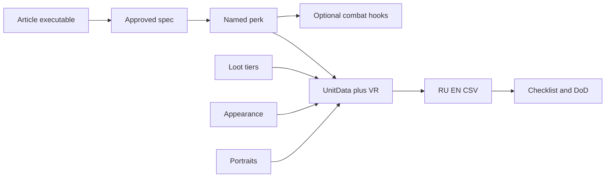

# План генерации наёмника (один за другим)

Канонический рабочий план для `$create-jazz-merc`: **один slug → доводка статьи → approved spec → полная генерация**. Не стартовать следующий мерк, пока текущий не закрыт (Ready + DoD).

Связано: [SKILL.md](../SKILL.md), [article-contract.md](article-contract.md), [unitdata-checklist.md](unitdata-checklist.md), каталог [`docs/design/mercs-ja12/`](../../../../docs/design/mercs-ja12/).

## Режим «путь 1» (обязательный для planned)

Если статья `executable: false` или gaps в StartingPerks / loot IDs / EN / refusals:

1. Дописать статью sensible defaults (не invent в код в обход статьи).
2. Выставить `executable: true`, Open blockers `none`.
3. Создать/обновить change-spec (`JAZZ-UNITS-00N`), DoR Ready, approval владельца.
4. Только потом — оркестрация skill.

Не генерировать из non-executable статьи. Не invent «сразу в код» без доводки design.

## Очередь

Хелпер: [`docs/design/mercs-ja12/_generation-queue.md`](../../../../docs/design/mercs-ja12/_generation-queue.md)  
Wave-spec: [`docs/specs/active/JAZZ-UNITS-002.md`](../../../../docs/specs/active/JAZZ-UNITS-002.md)

Порядок: **High → Medium → Low**. Портреты 300/2000 входят в DoD каждого slug.

## Фаза A — Design + Spec (до кода)

```text
- [ ] A1. Прочитать docs/design/mercs-ja12/<slug>.md целиком
- [ ] A2. Закрыть gaps: StartingPerks JA3, loot item IDs, EN Identity/Bio/perk, refusals/haggles/mitigations, VR buddy/dislike
- [ ] A3. executable: true; Open blockers: none; Validate article-contract + phrase-checklist
- [ ] A4. unit_id / portrait_id / Jazz_Perk_* / Loot_JAZZ_* свободны в jazz-units / jazz
- [ ] A5. Spec docs/specs/active/JAZZ-UNITS-00N.md (или reuse волны) + DoR Ready + approved_by
```

Spec write set типично включает:

- `jazz/CharacterEffect/Jazz_Perk_<…>.lua` (+ Code hooks, если перк меняет бой)
- `jazz-units/UnitData/<unit_id>.lua`, `items.lua`, `metadata.lua` (loot, Appearance, VR)
- `jazz-units/MercPortraits/<portrait_id>.png` + `_Big`
- `jazz/Russian.csv`, `jazz/English.csv`
- design article + README; technical/wiki при заметном игроку поведении

## Фаза B — Реализация (после DoR)

```text
- [ ] B1. Именной perk → jazz CharacterEffect + items/metadata ($sync-jazz-generated-data)
- [ ] B2. Combat/runtime hooks перка (только если Mechanics требуют Code; иначе stub+doc)
- [ ] B3. Loot_JAZZ_* + tier presets *50/*35/*25/*20 (или *10 как Spider)
- [ ] B4. AppearancePreset при отсутствии готового preset (клон близкого gender/role)
- [ ] B5. UnitData companion + ModItemUnitDataCompositeDef + VoiceResponse
- [ ] B6. $create-jazz-merc-portraits (JA2 face match если есть *.ja2-face.*; no weapons; class kit)
- [ ] B7. Wiring Portrait/BigPortrait
- [ ] B8. $manage-jazz-localization — needs Russian=0, needs English=0
- [ ] B9. Static audit unitdata-checklist + sync audit clean
- [ ] B10. Статья status: ready + пути артефактов; README → Ready; evidence/DoD в spec
```



## Sensible-fill правила

| Gap | Как заполнять |
| --- | --- |
| StartingPerks | По Specialization/role; эталоны Spouke/Barry/Red/Fidel/Lynx/Spider + именной perk |
| Loot *50 | Конкретные item ID из jazz/jazz-units; «satchel» → C4/ShapedCharge/TNT + detonators |
| National hate | Нет UnitData-поля → Haggle/Refusal через `CheckExpression` / hire conditions |
| Likes/Dislikes | Валидные unit ids; Refusals на dislike hired; Mitigations/ExtraParting на like |
| Appearance | Новый preset id из Wiring; клон близкого male/female AppearancePreset |
| EN тексты | Полный перевод RU; не оставлять «EN draft» |
| FallbackMissingVR | Из Wiring статьи или близкий vanilla VR |

## Границы

- Один мерк за change set / сессию генерации, если владелец не сказал иначе.
- Не пушить, не force-push, не релизить без отдельного одобрения.
- Не смешивать с mass format / несвязанным Lua.
- Портреты только в `jazz-units/MercPortraits` (не в jazz_assets).
- Appearance body — клон существующего preset; полный custom mesh out of scope, пока не запрошен.
- Runtime AC перка — `runtime`/`human`; static закрывает wiring.

## Экземпляр: Colby (первый в очереди)

Slug: `colby` · `unit_id: Jazz_Colby` · `portrait_id: Colby` · perk `Jazz_Perk_Colby` · loot `Loot_JAZZ_Colby` · spec **`JAZZ-UNITS-002`**.

| Поле | Значение |
| --- | --- |
| StartingPerks | `Jazz_Perk_Colby`, `MrFixit`, `Throwing`, `BreachAndClear`, `HitTheDeck`, `DesignerExplosives` |
| Named perk EN | Chain Panic — +20% blast radius; 20% panic on wounded enemies in blast |
| Likes / Dislikes | `Thor` / `Fidel` |
| National hate | Haggle при ≥1 hired `Nationality == "USA"` |
| Refusals | Fidel hired; death toll ≥1; money |
| Mitigations / ExtraParting | Thor hired; рекомендовать Thor |
| *50 kit | `ShapedCharge`×2, `C4`×2, `Lockpick`, `SmokeGrenade`×2, `JazzArmor_LeatherVest`, `MP5A4`+ammo, `Combination_Detonator_Remote` |
| Appearance | `Colby` (клон male demo-adjacent preset) |
| Identity EN | Name `Trevor Colby`, Title `The Tripwire` |
| FallbackMissingVR | `Ice` |
| Salary | 2800 / +200 / lv1 1200 / max 7000; level 5; Elite; MedicalDeposit large |

Perk hooks: `System_OR_Grenade.lua` (+ traps/weapons AoE при необходимости); panic через `OnCalcDamageAndEffects` / `AddStatusEffect("Panicked")`.

**Статус экземпляра:** wave JAZZ-UNITS-002 approved; генерация в работе.
