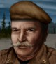

# Биггенс — Полковник Фредерик Биггенс

## Identity

| Field | RU | EN |
| --- | --- | --- |
| Name | Полковник Фредерик Биггенс | Colonel Frederick Biggens |
| Nick | Биггенс | Biggens |
| AllCapsNick | БИГГЕНС | BIGGENS |
| Title | Усталый дед | The Tired Old Colonel |
| Email | Biggens@ub.mil | Biggens@ub.mil |
| snype_nick | biggens | biggens |

## Bio

**RU:** Ветеран из Urban Brawl. Статы 55–65, Marksmanship 71, Explosives 92. Оптимист, плохо переносит жару. Ставит заряды по старой школе — надёжно и аккуратно.

**EN:** An Urban Brawl veteran. Stats in the 55-65 range, 71 Marksmanship, 92 Explosives. An optimist, doesn't handle heat well. Sets charges the old-school way — reliable and precise.

## Stats

| Stat | Value |
| --- | --- |
| Health | 60 |
| Agility | 55 |
| Dexterity | 55 |
| Strength | 55 |
| Wisdom | 70 |
| Will | 50 |
| Leadership | 40 |
| Marksmanship | 71 |
| Mechanical | 40 |
| Explosives | 92 |
| Medical | 20 |
| MaxHitPoints | 60 |
| StartingLevel | 3 |

## Perks

### StartingPerks

- `Jazz_Perk_Biggens`
- `Optimist`
- `DesignerExplosives`
- `NightOps`

### Named perk

| Field | Value |
| --- | --- |
| id | `Jazz_Perk_Biggens` |
| type | passive |
| DisplayName RU/EN | Старая школа / Old School |
| Description RU/EN | Заряды Биггенса труднее обнаружить и они быстрее взводятся / Biggens's charges are harder to spot and arm faster |
| Mechanics | Explosive charges and mines placed by Biggens are 25% harder for enemies to detect and take 25% less time to arm. |

## Personality

- Quirks: Optimist, FearHeat (Optimist wired; heat intolerance is bio flavor only)
- Likes: —
- Dislikes: —
- National hates: —
- Refusal / Haggle notes: no relationship triggers; standard local money and death-toll refusals only

## Hire

- Access: Locals / story unlock
- MedicalDeposit: small; Haggling: normal; DaysUntilOnline: 0

## Inventory

- Equipment loot id: `Loot_JAZZ_Biggens` → `JAZZ_Biggens50/35/25/20`
- *50: `JazzArmor_UniformPants`, `TNT`×2, `Detonator`, `Combination_Detonator_Time`, `Wirecutter`, `M1Garand`, `JAZZ_AMMO_3006_FMJ`×20 (Double)
- *35: `TNT`×1, `Detonator`, `M2Carbine`, `JAZZ_AMMO_30_FMJ`×16 (Double)
- *25: `PipeBomb`×1, `Detonator`, `Winchester1894`, `JAZZ_AMMO_30_P`×12 (Double)
- *20: `PipeBomb`×1, `SWModel10`, `JAZZ_AMMO_38special_FMJ`×12 (Double)

## JA2 face reference

Лицо в портрете должно быть **похоже на этот JA2-референс** (сохранить возраст, этничность, причёску, ключевые черты):

Файл: `biggens.ja2-face.jpg`

## Portrait prompt

**Rules:** no weapons in hands/on shoulder (holstered pistol only as last resort). Role via **class kit**. Face must match JA2 reference above.

**CHARACTER_DESCRIPTION:** Match JA2 face reference `biggens.ja2-face.jpg` (same face identity). Elderly tired colonel ~65, white hair, demo satchel and reading glasses — NO gun.

**Preferred refs:** `MercPortraits/References/` matching gender/role

**Class kit:** Demo satchel, glasses, colonel rank tabs

## Phrases — AIM chat

### Offline
- RU: Биггенс отдыхает. Перезвоните.
- EN: This is Biggens. Leave a message.

### GreetingAndOffer
- RU: Полковник Биггенс слушает.
- EN: Colonel Biggens here.

### ConversationRestart
- RU: Связь прервалась. Вернёмся к делу.
- EN: Line dropped. Let's get back to it.

### IdleLine
- RU: Жарковато сегодня, но не жалуюсь.
- EN: A bit hot today, but I'm not complaining.

### PartingWords
- RU: Ещё один заряд не помешает. Иду.
- EN: One more charge won't hurt. I'm in.

### RehireIntro
- RU: Контракт заканчивается. Продлеваем?
- EN: Contract's ending. Extending?

### RehireOutro
- RU: Остаюсь. Дело своё знаю.
- EN: I'm staying. I know my trade.

### Refusals
- Money RU: Маловато для полковника в отставке.
- Money EN: Not enough for a retired colonel.
- Death toll RU: Слишком много потерь для аккуратной работы.
- Death toll EN: Too many losses for tidy work.

## Phrases — VoiceResponse

- `voice_source: ub` — reuse legacy VO where available; RU/EN subtitle drafts for minimum slots:
  - Selection: «Биггенс готов.» / «Biggens's ready.»
  - AimAttack (1): «Заряд заложен.» / «Charge is set.»
  - AimAttack (2): «Отходим спокойно.» / «Falling back, easy now.»
  - OpponentKilled: «Цель уничтожена.» / «Target neutralized.»
  - DeathGeneral: «Хорошая была служба...» / «Been a good run...»
  - Downed: «Ранен, но держусь.» / «Hit, but holding.»
  - CombatStartDetected: «Внимание, противник.» / «Heads up, enemy.»
  - LevelUp: «Опыт не пропьёшь.» / «Experience never fades.»
  - AmmoLow: «Заряды на исходе.» / «Running low on charges.»
  - Idle: «Жарковато.» / «Bit hot.»

## Wiring

| Field | Value |
| --- | --- |
| Appearance | Biggens |
| VoiceResponseId | Jazz_Biggens |
| pollyvoice | Matthew |
| Portrait | Mod/Dv3mFVN/MercPortraits/Biggens.png |
| BigPortrait | Mod/Dv3mFVN/MercPortraits/Biggens_Big.png |
| CustomEquipGear | TryEquip Handheld A Firearm |
| FallbackMissingVR | Ice |
| Sources | AIM sheet «Наемники из JA1/2»; origin=ub |

## Open blockers

- none
