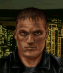

---
status: ready
priority: high
origin: ja2
unit_id: Jazz_Blade
portrait_id: Blade
affiliation: MERC
role: Scout
tier: Veteran
specialization: Melee
gender: Male
nationality: USA
voice_source: ja2
starting_level: 4
will: 55
salary:
  starting: 900
  increase: 200
  lv1: 400
  max: 2500
medical_deposit: standard
haggling: normal
executable: true
---

# Бритва — Билл «Бритва» Ламонт

## Identity

| Field | RU | EN |
| --- | --- | --- |
| Name | Билл «Бритва» Ламонт | Bill "Blade" Lamont |
| Nick | Бритва | Blade |
| AllCapsNick | БРИТВА | BLADE |
| Title | Нож не кончается | The Knife Never Runs Out |
| Email | Blade@merc.com | Blade@merc.com |
| snype_nick | sharpstuff | sharpstuff |

## Bio

**RU:** Бриллиант среди MERC. Статы 80–90, навыки около нуля — но в ноже «патроны» не кончаются. Псих, обожает резню в ближнем бою и не признаёт огнестрел серьёзным аргументом. Дружит с Фиделем и Нервным (родственные безумцы); не любит Бифа и Фло; презирает местных Арулько.

**EN:** MERC's diamond in the rough. Stats in the 80s-90s across the board, skills near zero — but a knife never runs out of "ammo." A certified psycho who loves close-quarters butchery and doesn't rate a gun as a serious argument. Friends with Fidel and Nervous (fellow lunatics); can't stand Biff or Flo; sneers at the Arulco locals.

## Stats

| Stat | Value |
| --- | --- |
| Health | 88 |
| Agility | 90 |
| Dexterity | 85 |
| Strength | 80 |
| Wisdom | 53 |
| Will | 55 |
| Leadership | 20 |
| Marksmanship | 50 |
| Mechanical | 0 |
| Explosives | 5 |
| Medical | 5 |
| MaxHitPoints | 88 |
| StartingLevel | 4 |

## Perks

### StartingPerks

- `Jazz_Perk_Blade`
- `Psycho`
- `MeleeTraining`
- `CQCTraining`
- `Berserker`
- `Hotblood`

### Named perk

| Field | Value |
| --- | --- |
| id | `Jazz_Perk_Blade` |
| type | passive |
| DisplayName RU/EN | Ураган клинков / Blade Storm |
| Description RU/EN | Заряд клинком достаёт дальше; атаки бойни получают +20% к шансу попадания, но не могут критовать / Knife Charge reaches farther; Rampage attacks gain +20% chance to hit but cannot score critical hits |
| Mechanics | (1) Charge attack range with any bladed melee weapon extended by 2 tiles; (2) Rampage (free follow-up melee attacks) gets +20% CTH and 0% crit chance — trades burst crit damage for reliability. Ties into Psycho/Berserker/Hotblood quirks already on the sheet. |

## Personality

- Quirks: `Psycho` (StartingPerk, loves close combat, ignores danger)
- Likes: `Jazz_Nervous` (planned merc, article pending), Fidel
- Dislikes: Biff, Flo (both planned mercs, articles pending)
- National hates: Arulco locals — flavor only; no matching UnitData nationality filter, expressed as Haggle below instead of a hard block
- Refusal / Haggle notes: aggressive hire; refuses on excessive death toll; haggles when squad is "too local"

## Hire

- Access: MERC roster
- MedicalDeposit: standard; Haggling: normal; DaysUntilOnline: 0

## Inventory

- Equipment loot id: `Loot_JAZZ_Blade` → `JAZZ_Blade50/35/25/20`
- *50: `JazzArmor_LeatherArmor`, `Knife_Balanced`, `Knife_Sharpened`, `SmokeGrenade`×2, `FirstAidKit`, `CombatStim`×2
- *35: `JazzArmor_LeatherJacketBlk`, `Knife_Sharpened`×2, `SmokeGrenade`×1, `FirstAidKit`
- *25: `JazzArmor_LeatherJacketBlk`, `Knife_Sharpened`×1, `Knife_Balanced`×1, `SmokeGrenade`×1
- *20: `JazzArmor_LeatherJacketBlk`, `Knife_Sharpened`×1

No primary firearm in any tier — Blade fights with blades and closes distance with smoke.

## JA2 face reference

Лицо в портрете должно быть **похоже на этот JA2-референс** (сохранить возраст, этничность, причёску, ключевые черты):

Файл: `blade.ja2-face.gif`

## Portrait prompt

**Rules:** no weapons in hands/on shoulder (holstered pistol only as last resort). Role via **class kit**.

**CHARACTER_DESCRIPTION:** Match JA2 face reference `blade.ja2-face.gif` (same face identity). Wiry intense American knife fighter, shaved temples, manic grin held back, tactical harness with multiple sheathed knives and whetstone — NO gun. Chaotic energy.

**Preferred refs:** `MercPortraits/References/` matching gender/role

**Class kit:** Knife sheaths, whetstone, blood-kit pouch, MERC patch

## Phrases — AIM chat

### Offline
- RU: Бритва занят — режет. Оставь сообщение, если жить надоело.
- EN: Blade's busy — cutting. Leave a message if you're tired of living.

### GreetingAndOffer
- RU: Чо надо? Резать будем?
- EN: What do you need? We cutting something?

### ConversationRestart
- RU: Связь прервалась. Ну, продолжай, а то нож стынет.
- EN: Line dropped. Get on with it, my knife's getting cold.

### IdleLine
- RU: Ножницы тупые — ножи нет. Двигай давай.
- EN: Scissors are dull, knife's gone missing. Move it.

### PartingWords
- RU: Я уже в пути, хе-хе. Кто-то там не доживёт до утра.
- EN: I'm already on my way, heh. Somebody's not seeing morning.

### RehireIntro
- RU: Контракт горит. Продлеваем или мне точить нож на кого-то другого?
- EN: Contract's burning out. Extending, or do I sharpen this on someone else?

### RehireOutro
- RU: Остаюсь. Ещё не всех порезал.
- EN: I'm staying. Haven't cut everyone yet.

### Refusals
- Death toll RU: Слишком много наших полегло. Даже мне это не по вкусу.
- Death toll EN: Too many of ours went down. Even I don't like that flavor.
- Money RU: За такие копейки я лучше дома ножи точить буду.
- Money EN: For that kind of change I'd rather stay home sharpening knives.

### Haggles
- Squad too local RU: У тебя тут одни местные. Скучно и опасно — доплати.
- Squad too local EN: Your whole crew's locals. Boring and risky — pay extra.

### Mitigations
- Nervous or Fidel hired RU: О, Нервный/Фидель уже здесь? Тогда не откажусь, будет весело.
- Nervous or Fidel hired EN: Oh, Nervous/Fidel's already in? Then I won't say no, this'll be fun.

### ExtraPartingWords
- RU: Хочешь ещё психа в команду — зови Фиделя.
- EN: Want one more psycho on the team — call Fidel.

## Phrases — VoiceResponse

- `voice_source: ja2` — reuse legacy VO where available; RU/EN subtitle drafts for minimum slots:
  - Selection: «Бритва на связи.» / «Blade's up.»
  - AimAttack (1): «Ближе... ближе...» / «Closer... closer...»
  - AimAttack (2): «Порежу на ленточки.» / «Gonna slice you up.»
  - OpponentKilled: «Чисто прошёл.» / «Clean cut.»
  - DeathGeneral: «Не тот нож взял...» / «Wrong knife for this...»
  - Downed: «Зацепили, гады!» / «They got me, bastards!»
  - CombatStartPlayer: «О, наконец-то!» / «Oh, finally!»
  - LevelUp: «Острее не бывает.» / «Sharper than ever.»
  - AmmoLow: «Нож не кончается — но патроны да.» / «Knife's endless — the gun's not.»
  - Idle: «Ну где веселье?» / «Where's the fun?»
  - MockDislike (Biff/Flo): «Опять этот зануда рядом.» / «This bore again.»
  - Praises (Nervous/Fidel present): «Хорошая компания подобралась.» / «Now that's good company.»

## Wiring

| Field | Value |
| --- | --- |
| Appearance | Blade |
| VoiceResponseId | Jazz_Blade |
| pollyvoice | Matthew |
| Portrait | Mod/Dv3mFVN/MercPortraits/Blade.png |
| BigPortrait | Mod/Dv3mFVN/MercPortraits/Blade_Big.png |
| CustomEquipGear | TryEquip Handheld A/B Melee (knife-first, no ranged default) |
| FallbackMissingVR | Ice |
| Sources | AIM sheet «Наемники из JA1/2»; origin=ja2 |

## Open blockers

- none
