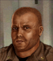

---
status: planned
priority: low
origin: ja2
unit_id: Jazz_Bull
portrait_id: Bull
affiliation: AIM
role: Melee
tier: Regular
specialization: Melee
gender: Male
nationality: USA
voice_source: ja2
starting_level: 2
will: 45
salary:
  starting: 400
  increase: 150
  lv1: 200
  max: 1500
medical_deposit: standard
haggling: normal
executable: false
---

# Бык — Джон «Бык» Питерс

## Identity

| Field | RU | EN |
| --- | --- | --- |
| Name | Джон «Бык» Питерс | Джон «Бык» Питерс |
| Nick | Бык | Bull |
| AllCapsNick | БЫК | BULL |
| Title | Дешёвый танк | Дешёвый танк |
| Email | Bull@aim.com | Bull@aim.com |
| snype_nick | bull | bull |

## Bio

**RU:** Самый дешёвый AIM: Health 96, Strength 98, Agility/Dex ~45–55, Wisdom 64, Marksmanship 72. Aggressive. Likes Nail; dislikes Biff.

**EN:** EN draft: translate Bio RU.

## Stats

| Stat | Value |
| --- | --- |
| Health | 96 |
| Agility | 50 |
| Dexterity | 50 |
| Strength | 98 |
| Wisdom | 64 |
| Will | 45 |
| Leadership | 15 |
| Marksmanship | 72 |
| Mechanical | 5 |
| Explosives | 5 |
| Medical | 5 |
| MaxHitPoints | 96 |
| StartingLevel | 2 |

## Perks

### StartingPerks

- (map JA2 skills)`n- named perk below

### Named perk

| Field | Value |
| --- | --- |
| id | `Jazz_Perk_Bull` |
| type | passive |
| DisplayName RU/EN | Грудная клетка / Грудная клетка |
| Description RU/EN | Удушье / нокдаун / Удушье / нокдаун |
| Mechanics | Melee: knockdown + unconscious chance each attack (weaker than Steroid knockback). ALT: unarmed torso hit chance to choke. |

## Personality

- Quirks: Aggressive
- Likes: Nail
- Dislikes: Biff
- National hates: —
- Refusal / Haggle notes: Cheap AIM

## Hire

- Access: AIM
- MedicalDeposit: standard; Haggling: normal; DaysUntilOnline: 0

## Inventory

- Equipment loot id: `Loot_JAZZ_Bull`
- Presets:
  - *50: brass knuckles, light armor

## JA2 face reference

Лицо в портрете должно быть **похоже на этот JA2-референс** (сохранить возраст, этничность, причёску, ключевые черты):

Файл: `bull.ja2-face.gif`

## Portrait prompt

**Rules:** no weapons in hands/on shoulder (holstered pistol only as last resort). Role via **class kit**.

**CHARACTER_DESCRIPTION:** Match JA2 face reference `bull.ja2-face.gif` (same face identity). Massive cheap AIM bruiser, bald, scarred knuckles wrap — NO gun. Dumb grin.

**Preferred refs:** `MercPortraits/References/` matching gender/role

**Class kit:** Knuckle wraps, torn shirt, AIM pin

## Phrases — AIM chat

### Offline
- RU: Бык спит.
- EN: Bull unavailable.

### GreetingAndOffer
- RU: Бык! Чо бить?
- EN: Bull here.

### ConversationRestart / IdleLine / PartingWords / Rehire
- Restart RU/EN: Вернёмся к делу. / Let's get back to it.
- Idle RU/EN: Где бить? / Well?
- Part RU/EN: Угх. Иду. / I'm in.
- RehireIntro: Контракт заканчивается. Продлеваем? / Contract's ending. Extending?
- RehireOutro: Остаюсь. / I'm staying.

### Extra
- Draft relationship lines at generation.

## Phrases — VoiceResponse

- `voice_source: ja2` — legacy VO reuse + minimum Selection/AimAttack/OpponentKilled/DeathGeneral/Downed/CombatStart/LevelUp/AmmoLow/Idle drafts.

## Wiring

| Field | Value |
| --- | --- |
| Appearance | Bull |
| VoiceResponseId | Jazz_Bull |
| pollyvoice | Matthew |
| Portrait / BigPortrait | Mod/Dv3mFVN/MercPortraits/Bull.png (+_Big) |
| FallbackMissingVR | Ice |
| Sources | AIM sheet JA1/2 block; origin=ja2 |

## Open blockers

- none
