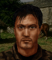

# Карлос — Карлос Дасуза

## Identity

| Field | RU | EN |
| --- | --- | --- |
| Name | Карлос Дасуза | Carlos Dasouza |
| Nick | Карлос | Carlos |
| AllCapsNick | КАРЛОС | CARLOS |
| Title | Пессимист | The Pessimist |
| Email | Carlos@arulco.reb | Carlos@arulco.reb |
| snype_nick | carlos | carlos |

## Bio

**RU:** Dexterity 61, Marksmanship 67, Agility 91. Пессимист, местный повстанец. Уважает Мигеля, Иру и Дмитрия; терпеть не может Игги.

**EN:** 61 Dexterity, 67 Marksmanship, 91 Agility. A pessimistic local rebel. Respects Miguel, Ira, and Dimitri; can't stand Iggy.

## Stats

| Stat | Value |
| --- | --- |
| Health | 70 |
| Agility | 91 |
| Dexterity | 61 |
| Strength | 65 |
| Wisdom | 55 |
| Will | 40 |
| Leadership | 30 |
| Marksmanship | 67 |
| Mechanical | 20 |
| Explosives | 25 |
| Medical | 20 |
| MaxHitPoints | 70 |
| StartingLevel | 3 |

## Perks

### StartingPerks

- `Jazz_Perk_Carlos`
- `Pessimist`
- `Stealthy`
- `Throwing`

### Named perk

| Field | Value |
| --- | --- |
| id | `Jazz_Perk_Carlos` |
| type | passive |
| DisplayName RU/EN | Тихая тень / Silent Shadow |
| Description RU/EN | Скрытное убийство ножом не выдаёт позицию и возвращает потраченные ОД / A stealth kill with a thrown knife doesn't break the squad's stealth and refunds the AP spent |
| Mechanics | When Carlos scores a stealth kill using a thrown knife, the squad's Hidden/stealth state is not broken and the AP spent on the throw is refunded. |

## Personality

- Quirks: Pessimist
- Likes: `Jazz_Miguel`, `Jazz_Ira`, `Jazz_Dimitri` (all planned mercs — Mitigation/ExtraPartingWords wiring activates once ready)
- Dislikes: `Iggy`
- National hates: —
- Refusal / Haggle notes: refuses if Iggy hired; standard local money refusal; mitigation and recommendation for Miguel/Ira/Dimitri when hired

## Hire

- Access: Locals hire
- MedicalDeposit: standard; Haggling: normal; DaysUntilOnline: 0

## Inventory

- Equipment loot id: `Loot_JAZZ_Carlos` → `JAZZ_Carlos50/35/25/20`
- *50: `JazzArmor_CamoBalaclava`, `Knife_Balanced`×3, `Scorpion`, `JAZZ_AMMO_762x25_FMJ`×24 (Double)
- *35: `Knife_Balanced`×2, `MicroUZI`, `JAZZ_AMMO_9x19_FMJ`×24 (Double)
- *25: `Knife`×2, `Makarov`, `JAZZ_AMMO_9x18_FMJ`×16 (Double)
- *20: `Knife`×1, `Unarmed`

## JA2 face reference

Лицо в портрете должно быть **похоже на этот JA2-референс** (сохранить возраст, этничность, причёску, ключевые черты):

Файл: `carlos.ja2-face.gif`

## Portrait prompt

**Rules:** no weapons in hands/on shoulder (holstered pistol only as last resort). Role via **class kit**. Face must match JA2 reference above.

**CHARACTER_DESCRIPTION:** Match JA2 face reference `carlos.ja2-face.gif` (same face identity). Lean pessimistic Arulco rebel scout ~30, dark mood, binoculars around neck, throwing-knife sheath on chest — NO gun.

**Preferred refs:** `MercPortraits/References/` matching gender/role

**Class kit:** Binoculars, throwing-knife sheath, rebel scarf

## Phrases — AIM chat

### Offline
- RU: Карлос... зачем звонить? Всё равно плохо кончится.
- EN: This is Carlos. Leave a message.

### GreetingAndOffer
- RU: Карлос слушает. Плохие новости?
- EN: Carlos here. Bad news?

### ConversationRestart
- RU: Связь прервалась. Вернёмся к делу.
- EN: Line dropped. Let's get back to it.

### IdleLine
- RU: Как обычно, всё плохо.
- EN: Same as always — bad.

### PartingWords
- RU: Ладно. Иду. Скорее всего, зря.
- EN: Fine. I'm in. Probably a mistake.

### RehireIntro
- RU: Контракт заканчивается. Продлеваем?
- EN: Contract's ending. Extending?

### RehireOutro
- RU: Остаюсь. Хуже уже не будет.
- EN: I'm staying. Can't get worse.

### Refusals
- Iggy hired RU: Пока Игги в отряде — я пас.
- Iggy hired EN: Not while Iggy's on the team.
- Money RU: Маловато. Как я и думал.
- Money EN: Not enough. Figures.

### Mitigations
- Miguel/Ira/Dimitri hired RU: О, Мигель (Ира, Дмитрий) уже здесь? Тогда, наверное, справимся.
- Miguel/Ira/Dimitri hired EN: Oh, Miguel (Ira, Dimitri) is already in? Then maybe we'll manage.

### ExtraPartingWords
- RU: Если нужен ещё один разведчик — зовите Мигеля.
- EN: If you need another scout, call Miguel.

## Phrases — VoiceResponse

- `voice_source: ja2` — reuse legacy VO where available; RU/EN subtitle drafts for minimum slots:
  - Selection: «Карлос готов. Как всегда, зря.» / «Carlos's ready. For nothing, probably.»
  - AimAttack (1): «Целюсь.» / «Aiming.»
  - AimAttack (2): «Ладно, попробуем.» / «Fine, let's try.»
  - OpponentKilled: «Одним меньше.» / «One less.»
  - DeathGeneral: «Я предупреждал...» / «I warned you...»
  - Downed: «Меня зацепило. Как и ожидалось.» / «I'm hit. As expected.»
  - CombatStartDetected: «Началось. Конечно.» / «It's starting. Of course.»
  - LevelUp: «Хм. Неожиданно.» / «Huh. Unexpected.»
  - AmmoLow: «Патроны кончаются.» / «Running low on ammo.»
  - Idle: «Опять ждём.» / «Waiting again.»
  - MockDislike (Iggy): «Хорошо, что Игги тут нет.» / «Good thing Iggy's not here.»

## Wiring

| Field | Value |
| --- | --- |
| Appearance | Carlos |
| VoiceResponseId | Jazz_Carlos |
| pollyvoice | Matthew |
| Portrait | Mod/Dv3mFVN/MercPortraits/Carlos.png |
| BigPortrait | Mod/Dv3mFVN/MercPortraits/Carlos_Big.png |
| CustomEquipGear | TryEquip Handheld A Melee |
| FallbackMissingVR | Ice |
| Sources | AIM sheet «Наемники из JA1/2»; origin=ja2 |

## Open blockers

- none
