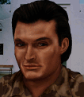

---
status: planned
priority: high
origin: ja2
unit_id: Jazz_Conrad
portrait_id: Conrad
affiliation: MERC
role: Commander
tier: Elite
specialization: Leader
gender: Male
nationality: Germany
voice_source: ja2
starting_level: 5
will: 75
salary:
  starting: 3300
  increase: 200
  lv1: 2000
  max: 8000
medical_deposit: large
haggling: high
executable: false
---

# Конрад — Лейтенант Конрад Джиллет

## Identity

| Field | RU | EN |
| --- | --- | --- |
| Name | Лейтенант Конрад Джиллет | Лейтенант Конрад Джиллет |
| Nick | Конрад | Conrad |
| AllCapsNick | КОНРАД | CONRAD |
| Title | Дорогой лейтенант | Дорогой лейтенант |
| Email | Conrad@merc.com | Conrad@merc.com |
| snype_nick | ltgillett | ltgillett |

## Bio

**RU:** Сильнейший из доступных местных: 75–80 статы, Leadership 51 + Teacher, Marksmanship 95. Дружит с Iggy и Стефаном; не любит Larry drunk; не умеет плавать. Дорог.

**EN:** EN draft: translate Bio RU at generation; keep tone.

## Stats

| Stat | Value |
| --- | --- |
| Health | 80 |
| Agility | 69 |
| Dexterity | 78 |
| Strength | 78 |
| Wisdom | 80 |
| Will | 75 |
| Leadership | 51 |
| Marksmanship | 95 |
| Mechanical | 55 |
| Explosives | 68 |
| Medical | 40 |
| MaxHitPoints | 80 |
| StartingLevel | 5 |

## Perks

### StartingPerks

- (map JA2 skills to JA3 StartingPerks)
- `Jazz_Perk_Conrad`

### Named perk

| Field | Value |
| --- | --- |
| id | `Jazz_Perk_Conrad` |
| type | passive |
| DisplayName RU/EN | Строгий инструктор / Строгий инструктор |
| Description RU/EN | Полный тренинг-темп / Полный тренинг-темп |
| Mechanics | Keep Conrad training at full rate; other trainers may be halved (sheet proposal). Needs balance confirm. |

## Personality

- Quirks: CannotSwim
- Likes: Iggy, Jazz_Rothman
- Dislikes: Larry (drugged)
- National hates: Americans
- Refusal / Haggle notes: Expensive haggle

## Hire

- Access: Locals → MERC after Arulco
- MedicalDeposit: large; Haggling: high; DaysUntilOnline: 0

## Inventory

- Equipment loot id: `Loot_JAZZ_Conrad`
- Presets (weights ~50/35/25/20):
  - *50: battle rifle family, officer coat, training manuals, binoculars

## JA2 face reference

Лицо в портрете должно быть **похоже на этот JA2-референс** (сохранить возраст, этничность, причёску, ключевые черты):

Файл: `conrad.ja2-face.gif`

## Portrait prompt

**Rules:** no weapons in hands/on shoulder (holstered pistol only as last resort). Role via **class kit**.

**CHARACTER_DESCRIPTION:** Match JA2 face reference `conrad.ja2-face.gif` (same face identity). Fit German ex-officer ~40, neat hair, officer field jacket with instructor tabs and binoculars on chest — NO rifle. Stern professional.

**Preferred refs:** `MercPortraits/References/` matching gender/role

**Class kit:** Instructor tabs, binoculars, map case, whistle

## Phrases — AIM chat

### Offline
- RU: Лейтенант Джиллет. Оставьте сообщение.
- EN: This is Conrad. Leave a message.

### GreetingAndOffer
- RU: Джиллет слушает. Условия?
- EN: Conrad here. Talk.

### ConversationRestart
- RU: Вернёмся к делу.
- EN: Let's get back to it.

### IdleLine
- RU: Время — деньги.
- EN: Waiting on you.

### PartingWords
- RU: Контракт принят.
- EN: I'm in.

### RehireIntro
- RU: Контракт заканчивается. Продлеваем?
- EN: Contract's ending. Extending?

### RehireOutro
- RU: Остаюсь.
- EN: I'm staying.

### Refusals / Haggles / Mitigations / ExtraPartingWords
- Draft relationship refusals/haggles from Personality at generation time.

## Phrases — VoiceResponse

- `voice_source: ja2` — reuse legacy VO where available; RU/EN subtitle drafts for minimum slots:
  - Selection: «Конрад!» / «Conrad!»
  - AimAttack: «На мушке.» / «On target.»
  - OpponentKilled: «Готово.» / «Done.»
  - DeathGeneral: «Чёрт...» / «Damn...»
  - Downed: «Меня подбили!» / «I'm hit!»
  - CombatStartPlayer: «В бой.» / «Engage.»
  - LevelUp: «Ещё лучше.» / «Getting better.»
  - AmmoLow: «Патроны!» / «Ammo!»
  - Idle: «Жду.» / «Waiting.»
- Relationship VR slots per Likes/Dislikes when generating.

## Wiring

| Field | Value |
| --- | --- |
| Appearance | Conrad |
| VoiceResponseId | Jazz_Conrad |
| pollyvoice | Matthew |
| Portrait | Mod/Dv3mFVN/MercPortraits/Conrad.png |
| BigPortrait | Mod/Dv3mFVN/MercPortraits/Conrad_Big.png |
| CustomEquipGear | TryEquip Handheld A/B Firearm (or melee for knife mercs) |
| FallbackMissingVR | Ice |
| Sources | AIM sheet «Наемники из JA1/2»; origin=ja2 |

## Open blockers

- training rate interaction with other Teachers: needs-design
