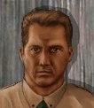

---
status: planned
priority: medium
origin: ja2
unit_id: Jazz_Cougar
portrait_id: Cougar
affiliation: MERC
role: Autorifleman
tier: Veteran
specialization: Stealth
gender: Male
nationality: USA
voice_source: ja2
starting_level: 4
will: 70
salary:
  starting: 1600
  increase: 200
  lv1: 700
  max: 4000
medical_deposit: standard
haggling: normal
executable: false
---

# Пума — Джим «Пума» Уоллесс

## Identity

| Field | RU | EN |
| --- | --- | --- |
| Name | Джим «Пума» Уоллесс | Джим «Пума» Уоллесс |
| Nick | Пума | Cougar |
| AllCapsNick | ПУМА | COUGAR |
| Title | Тихий автоматчик | Тихий автоматчик |
| Email | Cougar@merc.com | Cougar@merc.com |
| snype_nick | puma | puma |

## Bio

**RU:** Статы 80–88, Marksmanship 93, Mech 58, Exp 45, Med 33. Дружит с Wolf и Len. AutoWeapons + Stealth.

**EN:** EN draft: translate Bio RU at generation.

## Stats

| Stat | Value |
| --- | --- |
| Health | 85 |
| Agility | 88 |
| Dexterity | 80 |
| Strength | 80 |
| Wisdom | 70 |
| Will | 70 |
| Leadership | 30 |
| Marksmanship | 93 |
| Mechanical | 58 |
| Explosives | 45 |
| Medical | 33 |
| MaxHitPoints | 85 |
| StartingLevel | 4 |

## Perks

### StartingPerks

- (map JA2 skills to JA3 StartingPerks)
- `Jazz_Perk_Cougar`

### Named perk

| Field | Value |
| --- | --- |
| id | `Jazz_Perk_Cougar` |
| type | passive |
| DisplayName RU/EN | Мягкая лапа / Мягкая лапа |
| Description RU/EN | Шум ×0.5 и стелс-килл / Шум ×0.5 и стелс-килл |
| Mechanics | Noise ×0.5; +10–15% stealth kill chance; reduced stealth-kill detection; successful stealth kill refunds opening AP. |

## Personality

- Quirks: —
- Likes: Wolf, Len
- Dislikes: —
- National hates: —
- Refusal / Haggle notes: MERC

## Hire

- Access: MERC
- MedicalDeposit: standard; Haggling: normal; DaysUntilOnline: 0

## Inventory

- Equipment loot id: `Loot_JAZZ_Cougar`
- Presets (weights ~50/35/25/20):
  - *50: suppressed SMG kit (in loot, not portrait), camo, lockpicks

## JA2 face reference

Лицо в портрете должно быть **похоже на этот JA2-референс** (сохранить возраст, этничность, причёску, ключевые черты):

Файл: `cougar.ja2-face.gif`

## Portrait prompt

**Rules:** no weapons in hands/on shoulder (holstered pistol only as last resort). Role via **class kit**.

**CHARACTER_DESCRIPTION:** Match JA2 face reference `cougar.ja2-face.gif` (same face identity). Lean stealthy American, camo facepaint light, ghillie scraps and suppressed-ammo pouches — NO gun. Quiet eyes.

**Preferred refs:** `MercPortraits/References/` matching gender/role

**Class kit:** Ghillie scraps, soft pouches, camo paint, quiet boots

## Phrases — AIM chat

### Offline
- RU: Пума вне зоны.
- EN: This is Cougar. Leave a message.

### GreetingAndOffer
- RU: Пума. Говори тихо.
- EN: Cougar here.

### ConversationRestart
- RU: Вернёмся к делу.
- EN: Let's get back to it.

### IdleLine
- RU: ...
- EN: Waiting.

### PartingWords
- RU: Уже в тени.
- EN: I'm in.

### RehireIntro
- RU: Контракт заканчивается. Продлеваем?
- EN: Contract's ending. Extending?

### RehireOutro
- RU: Остаюсь.
- EN: I'm staying.

### Refusals / Haggles / Mitigations / ExtraPartingWords
- Draft relationship refusals/haggles from Personality at generation time.

## Phrases — VoiceResponse

- `voice_source: ja2` — reuse legacy VO where available; RU/EN subtitle drafts for minimum slots:
  - Selection: «Пума!» / «Cougar!»
  - AimAttack / OpponentKilled / DeathGeneral / Downed / CombatStartPlayer / LevelUp / AmmoLow / Idle — standard drafts + relationship slots.

## Wiring

| Field | Value |
| --- | --- |
| Appearance | Cougar |
| VoiceResponseId | Jazz_Cougar |
| pollyvoice | Matthew |
| Portrait | Mod/Dv3mFVN/MercPortraits/Cougar.png |
| BigPortrait | Mod/Dv3mFVN/MercPortraits/Cougar_Big.png |
| CustomEquipGear | TryEquip Handheld A/B as role requires |
| FallbackMissingVR | Ice |
| Sources | AIM sheet «Наемники из JA1/2»; origin=ja2 |

## Open blockers

- none
