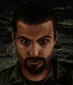

---
status: ready
priority: high
origin: ja2
unit_id: Jazz_Dimitri
portrait_id: Dimitri
affiliation: Locals
role: Thrower
tier: Regular
specialization: ExplosiveExpert
gender: Male
nationality: Russia
voice_source: ja2
starting_level: 3
will: 60
salary:
  starting: 500
  increase: 200
  lv1: 250
  max: 1800
medical_deposit: standard
haggling: normal
executable: true
---

# Димитрий — Димитрий Газзо

## Identity

| Field | RU | EN |
| --- | --- | --- |
| Name | Димитрий Газзо | Dimitri Gazzo |
| Nick | Димитрий | Dimitri |
| AllCapsNick | ДИМИТРИЙ | DIMITRI |
| Title | Я забыл опять | I Forgot Again |
| Email | Dima@arulco.reb | Dima@arulco.reb |
| snype_nick | forgotagain | forgotagain |

## Bio

**RU:** Статы под 70, ловкость 50, механика 71. Забывчивый — может остановиться посреди хода и переспросить, куда шёл. Дружит с Мигелем и Карлосом; недолюбливает Ротмана за высокомерие. Крафтит и точит собственные метательные ножи — бонус к ведущему навыку броска.

**EN:** Stats around 70, Agility 50, Mechanical 71. Forgetful — may stop mid-move and ask where he was headed (Bio flavor only, no gameplay penalty). Friends with Miguel and Carlos; dislikes Rothman's arrogance. Crafts and hones his own throwing knives for a bonus to his governing throw skill check.

## Stats

| Stat | Value |
| --- | --- |
| Health | 70 |
| Agility | 50 |
| Dexterity | 65 |
| Strength | 70 |
| Wisdom | 56 |
| Will | 60 |
| Leadership | 30 |
| Marksmanship | 60 |
| Mechanical | 71 |
| Explosives | 40 |
| Medical | 15 |
| MaxHitPoints | 70 |
| StartingLevel | 3 |

## Perks

### StartingPerks

- `Jazz_Perk_Dimitri`
- `Throwing`
- `MrFixit`
- `CQCTraining`

### Named perk

| Field | Value |
| --- | --- |
| id | `Jazz_Perk_Dimitri` |
| type | passive |
| DisplayName RU/EN | Точильщик / The Whetstone |
| Description RU/EN | Носит с собой запас доведённых до остроты бритвы метательных ножей: +20 к проверке ведущего навыка броска / Carries a finite stock of razor-honed throwing knives: +20 to the governing throw skill check |
| Mechanics | Finite consumable knives (not an infinite-ammo effect like `Blood`'s knife perk); each combat start restocks a fixed pool of `Knife_Balanced`/`Knife_Sharpened` in a dedicated slot, and throws with those knives get +20 to the throw check. |

## Personality

- Quirks: "Forgetful" — flavor only in Bio/AIM chat; JA3 has no move-cancel/forgetfulness system, so this is not implemented as a StartingPerk or hire condition
- Likes: Miguel, Carlos (both planned mercs — Mitigation/ExtraPartingWords wiring activates once each reaches `status: ready`)
- Dislikes: `Jazz_Rothman` (planned merc — Refusal wiring activates once ready)
- National hates: none
- Refusal / Haggle notes: local hire, no fee; refuses only if Rothman already hired

## Hire

- Access: Locals — available once the player makes contact with the Arulco resistance cell holding Dimitri's home sector
- MedicalDeposit: standard; Haggling: normal; DaysUntilOnline: 0

## Inventory

- Equipment loot id: `Loot_JAZZ_Dimitri` → `JAZZ_Dimitri50/35/25/20`
- *50: `JazzArmor_LeatherArmor`, `Knife_Balanced`×3, `Knife_Sharpened`×2, `FragGrenade`×1
- *35: `JazzArmor_LeatherArmor`, `Knife_Balanced`×2, `Knife_Sharpened`×1
- *25: `JazzArmor_LeatherJacketBrn`, `Knife_Balanced`×2
- *20: `JazzArmor_LeatherJacketBrn`, `Knife_Balanced`×1

No firearm in any tier — Dimitri's entire kit is thrown knives plus one frag at the top tier.

## JA2 face reference

Лицо в портрете должно быть **похоже на этот JA2-референс** (сохранить возраст, этничность, причёску, ключевые черты):

Файл: `dimitri.ja2-face.gif`

## Portrait prompt

**Rules:** no weapons in hands/on shoulder (holstered pistol only as last resort). Role via **class kit**.

**CHARACTER_DESCRIPTION:** Match JA2 face reference `dimitri.ja2-face.gif` (same face identity). Stocky forgetful Russian rebel, messy hair, sheepish smile, bandolier of throwing knives and sharpening stone — knives as tools sheathed, not mid-throw pose with intent to shoot. Soft eyes.

**Preferred refs:** `MercPortraits/References/` matching gender/role

**Class kit:** Throwing knife bandolier (sheathed), whetstone, tool roll

## Phrases — AIM chat

### Offline
- RU: Дима... э-э... перезвоните. Я забыл, зачем мне телефон.
- EN: Dima... uh... call back later. I forgot why I have this phone.

### GreetingAndOffer
- RU: А? Это я. Димитрий. Кажется. Работа есть?
- EN: Huh? It's me. Dimitri. I think. You got work?

### ConversationRestart
- RU: Стоп, о чём мы говорили? А, точно — вернёмся к делу.
- EN: Wait, what were we talking about? Right — let's get back to it.

### IdleLine
- RU: Стой... куда я шёл? А, точно, помогать тебе.
- EN: Hold on... where was I going? Right, helping you.

### PartingWords
- RU: Так, ножи с собой... вроде все. Иду.
- EN: Okay, knives packed... think that's all of them. I'm coming.

### RehireIntro
- RU: Контракт заканчивается. Продлеваем, или я опять забуду, где мои ножи?
- EN: Contract's ending. Extending, or do I go misplace my knives again?

### RehireOutro
- RU: Остаюсь. Ножи точить веселее, когда есть цель.
- EN: I'm staying. Sharpening knives is more fun with a target.

### Refusals
- Rothman hired RU: Пока Ротман у вас — извини, нет. Он на местных смотрит свысока.
- Rothman hired EN: Not while Rothman's with you — sorry. He looks down on us locals.

### Mitigations
- Miguel/Carlos hired RU: О, Мигель или Карлос уже здесь? Тогда я спокоен, иду.
- Miguel/Carlos hired EN: Oh, Miguel or Carlos already in? Then I'm at ease, count me in.

### ExtraPartingWords
- RU: Если найдёте Мигеля или Карлоса — берите. С ними я работаю лучше.
- EN: If you find Miguel or Carlos — take them. I work better with them around.

## Phrases — VoiceResponse

- `voice_source: ja2` — reuse legacy VO where available; RU/EN subtitle drafts for minimum slots:
  - Selection: «Димитрий! Э-э, да, я тут.» / «Dimitri! Uh, yeah, I'm here.»
  - AimAttack (1): «Куда я его дел... а, вот!» / «Where'd I put it... ah, there!»
  - AimAttack (2): «Летит!» / «Incoming!»
  - OpponentKilled: «Попал! Даже сам не ожидал.» / «Got him! Didn't even expect that myself.»
  - DeathGeneral: «Забыл пригнуться...» / «Forgot to duck...»
  - Downed: «Меня зацепило! Кто меня подстрелил?» / «I'm hit! Who shot me?»
  - CombatStartDetected: «О! Бой! Погодите, я готов?» / «Oh! A fight! Wait, am I ready?»
  - LevelUp: «Кажется, я что-то запомнил на этот раз.» / «I think I actually remembered something this time.»
  - NoAmmo: «Ножи кончились!» / «Out of knives!»
  - Idle: «А что я должен делать?» / «What am I supposed to be doing?»
  - MockDislike (Rothman): «Опять этот Ротман бы поворчал.» / «Rothman would grumble about this.»
  - Praises (Miguel/Carlos present): «Хорошо, что свои рядом.» / «Good to have my own people close.»

## Wiring

| Field | Value |
| --- | --- |
| Appearance | Dimitri |
| VoiceResponseId | Jazz_Dimitri |
| pollyvoice | Matthew |
| Portrait | Mod/Dv3mFVN/MercPortraits/Dimitri.png |
| BigPortrait | Mod/Dv3mFVN/MercPortraits/Dimitri_Big.png |
| CustomEquipGear | TryEquip Handheld A/B Melee (throwing knife slot, no ranged default) |
| FallbackMissingVR | Ice |
| Sources | AIM sheet «Наемники из JA1/2»; origin=ja2 |

## Open blockers

- none
