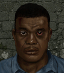

# Динамо — Грег «Динамо» Дункан

## Identity

| Field | RU | EN |
| --- | --- | --- |
| Name | Грег «Динамо» Дункан | Greg "Dynamo" Duncan |
| Nick | Динамо | Dynamo |
| AllCapsNick | ДИНАМО | DYNAMO |
| Title | Зек-механик | The Ex-Con Mechanic |
| Email | Dynamo@merc.com | Dynamo@merc.com |
| snype_nick | dynamo | dynamo |

## Bio

**RU:** Статы 55–65, Marksmanship 68, Mechanical 67, Wisdom 78. Бывший заключённый с извращённым чувством юмора насчёт ранений — знает, куда бить, чтобы противник ослеп или запаниковал. Дружит с Шенком и Кровью; не любит Мясо. Дёшев, готов работать почти за идею.

**EN:** Stats in the 55-65 range, 68 Marksmanship, 67 Mechanical, 78 Wisdom. A former convict with a twisted sense of humor about wounds — knows exactly where to hit to blind or panic an enemy. Friends with Shank and Blood; can't stand Meat. Cheap, willing to work for almost nothing.

## Stats

| Stat | Value |
| --- | --- |
| Health | 60 |
| Agility | 60 |
| Dexterity | 55 |
| Strength | 65 |
| Wisdom | 78 |
| Will | 45 |
| Leadership | 20 |
| Marksmanship | 68 |
| Mechanical | 67 |
| Explosives | 20 |
| Medical | 15 |
| MaxHitPoints | 60 |
| StartingLevel | 3 |

## Perks

### StartingPerks

- `Jazz_Perk_Dynamo`
- `MrFixit`
- `Psycho`
- `OptimalPerformance`

### Named perk

| Field | Value |
| --- | --- |
| id | `Jazz_Perk_Dynamo` |
| type | passive |
| DisplayName RU/EN | Вилкой в глаз / Fork to the Eye |
| Description RU/EN | Особые эффекты от ранений в конкретные зоны / Special effects from wounds to specific body parts |
| Mechanics | When Dynamo lands a headshot, the target has a 25% chance to gain `Blinded` for 1 turn on top of normal headshot effects. When he lands a groin-area hit, the target has a 25% chance to gain a panic/flee status instead of the normal groin effect. If Dynamo himself is hit in the groin, he instead gains a berserk-style +20% damage buff for 2 turns rather than the normal debuff, reflecting his high pain tolerance. |

## Personality

- Quirks: Psycho (StartingPerk)
- Likes: `Jazz_Shank` (planned merc — Mitigation/ExtraPartingWords wiring activates once ready), `Blood`
- Dislikes: `Jazz_Meat` (planned merc — Refusal wiring activates once ready)
- National hates: none — the original sheet's "hates Hungarians" note doesn't apply, since Dynamo is himself Hungarian; treated as a data-entry mismatch and dropped
- Refusal / Haggle notes: refuses if Meat hired; standard MERC money/death-toll refusals; mitigation if Shank or Blood hired

## Hire

- Access: Locals during the Arulco campaign, transitions to MERC roster afterward once the campaign concludes (flavor-only affiliation change, same unit)
- MedicalDeposit: none; Haggling: normal; DaysUntilOnline: 0

## Inventory

- Equipment loot id: `Loot_JAZZ_Dynamo` → `JAZZ_Dynamo50/35/25/20`
- *50: `JazzArmor_LeatherJacketBrn`, `Crowbar`, `Lockpick`, `Parts`×15, `CombatStim`×1
- *35: `JazzArmor_LeatherJacketBrn`, `Crowbar`, `Lockpick`, `Parts`×10
- *25: `JazzArmor_LeatherPants`, `Crowbar`, `Parts`×5
- *20: `Crowbar`, `Lockpick`

No firearm in any tier — Dynamo is strictly a crowbar-and-lockpicks mechanic, same pattern as Madman.

## JA2 face reference

Лицо в портрете должно быть **похоже на этот JA2-референс** (сохранить возраст, этничность, причёску, ключевые черты):

Файл: `dynamo.ja2-face.gif`

## Portrait prompt

**Rules:** no weapons in hands/on shoulder (holstered pistol only as last resort). Role via **class kit**.

**CHARACTER_DESCRIPTION:** Match JA2 face reference `dynamo.ja2-face.gif` (same face identity). Prison-hardened mechanic ~35, buzz cut, tool belt and lockpicks on hip — NO gun. Cocky grin.

**Preferred refs:** `MercPortraits/References/` matching gender/role

**Class kit:** Lockpick set, tool belt, visible prison tattoo, wrench

## Phrases — AIM chat

### Offline
- RU: Динамо вне зоны — наверно чинит что-то. Пиши.
- EN: This is Dynamo. Probably fixing something. Leave a message.

### GreetingAndOffer
- RU: Динамо. Чо надо?
- EN: Dynamo here. What do you need?

### ConversationRestart
- RU: Связь прервалась. Вернёмся к делу.
- EN: Line dropped. Let's get back to it.

### IdleLine
- RU: Давай уже, время не резиновое.
- EN: Come on, time's not infinite.

### PartingWords
- RU: За идею пойду — или за полтинник. Разницы нет.
- EN: I'll go for the cause — or for fifty bucks. Makes no difference.

### RehireIntro
- RU: Контракт заканчивается. Продлеваем?
- EN: Contract's ending. Extending?

### RehireOutro
- RU: Остаюсь. Тут ещё есть что чинить и кого пугать.
- EN: I'm staying. Still stuff to fix and people to scare.

### Refusals
- Meat hired RU: Пока Мясо в отряде — нет. Терпеть его не могу.
- Meat hired EN: Not while Meat's on the team. Can't stand the guy.

### Mitigations
- Shank/Blood hired RU: Шенк или Кровь уже здесь? Тогда ладно, повеселимся.
- Shank/Blood hired EN: Shank or Blood already in? Then fine, this'll be fun.

### ExtraPartingWords
- RU: Возьмите ещё Шенка — с ним чинить веселее.
- EN: Grab Shank too — fixing things is more fun with him around.

## Phrases — VoiceResponse

- `voice_source: ja2` — reuse legacy VO where available; RU/EN subtitle drafts for minimum slots:
  - Selection: «Динамо готов!» / «Dynamo's ready!»
  - AimAttack (1): «В глаз, точно в глаз!» / «Right in the eye!»
  - AimAttack (2): «Больно будет.» / «This is gonna hurt.»
  - OpponentKilled: «Красота!» / «Beautiful!»
  - DeathGeneral: «Не по мне такой финал...» / «Not how I planned to go...»
  - Downed: «Приложило! Но я в норме, ха.» / «Got clocked! But I'm fine, ha.»
  - CombatStartPlayer: «Наконец-то работа!» / «Finally, some work!»
  - LevelUp: «Ещё пара трюков в запасе.» / «Got a few more tricks now.»
  - NoAmmo: «Патроны кончились — сойдёт и лом!» / «Out of ammo — crowbar'll do!»
  - Idle: «Скучно! Дайте что-нибудь взломать.» / «Boring! Give me something to pick.»
  - MockDislike (Meat): «Хоть бы Мясо тут не было.» / «Hope Meat's not around.»
  - Praises (Shank/Blood present): «С этими двумя веселее работать.» / «It's more fun working with these two.»

## Wiring

| Field | Value |
| --- | --- |
| Appearance | Dynamo |
| VoiceResponseId | Jazz_Dynamo |
| pollyvoice | Matthew |
| Portrait | Mod/Dv3mFVN/MercPortraits/Dynamo.png |
| BigPortrait | Mod/Dv3mFVN/MercPortraits/Dynamo_Big.png |
| CustomEquipGear | TryEquip Handheld A/B Melee (crowbar-first, no ranged default) |
| FallbackMissingVR | Ice |
| Sources | AIM sheet «Наемники из JA1/2»; origin=ja2 |

## Open blockers

- none
