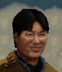

# Эскимо — Эмиль «Эскимо» Кимос

## Identity

| Field | RU | EN |
| --- | --- | --- |
| Name | Эмиль «Эскимо» Кимос | Emile "Eskimo" Kimos |
| Nick | Эскимо | Eskimo |
| AllCapsNick | ЭСКИМО | ESKIMO |
| Title | Пленный снайпер | The Imprisoned Sniper |
| Email | Eskimo@arulco.reb | Eskimo@arulco.reb |
| snype_nick | eskimo | eskimo |

## Bio

**RU:** Night Ops. Повстанец, воевавший за Мигеля; схвачен и брошен Дейдранной в тюрьму Альмы. После освобождения присоединяется к игроку. Ненавидит арабов и жару. Любит Мигеля, Карлоса и Гамоса. Здоровье 97, Меткость 95.

**EN:** Night Ops mercenary. A rebel who fought for Miguel; captured and thrown into the Alma prison by Deidranna. Joins the player after being freed. Hates Arabs and heat. Fond of Miguel, Carlos, and Gamos. 97 Health, 95 Marksmanship.

## Stats

| Stat | Value |
| --- | --- |
| Health | 97 |
| Agility | 68 |
| Dexterity | 70 |
| Strength | 70 |
| Wisdom | 55 |
| Will | 60 |
| Leadership | 25 |
| Marksmanship | 95 |
| Mechanical | 10 |
| Explosives | 10 |
| Medical | 15 |
| MaxHitPoints | 97 |
| StartingLevel | 3 |

## Perks

### StartingPerks

- `Jazz_Perk_Eskimo`
- `Stealthy`
- `SteadyBreathing`
- `TrueGrit`

### Named perk

| Field | Value |
| --- | --- |
| id | `Jazz_Perk_Eskimo` |
| type | passive |
| DisplayName RU/EN | Тюремная выдержка / Prison-Hardened |
| Description RU/EN | Годы в тюрьме Альмы закалили Эскимо: он не паникует и стреляет метко даже раненым / Years in the Alma prison hardened Eskimo — he doesn't panic and stays accurate even wounded |
| Mechanics | Eskimo's CTH with rifles is not reduced by the Wounded status, and he is immune to Panicked while below 50% health. |

## Personality

- Quirks: FearHeat
- Likes: `Miguel`, `Jazz_Carlos`, `Jazz_Gamos`
- Dislikes: —
- National hates: Arabs — Refusal trigger when the active squad includes an Arab-nationality merc
- Refusal / Haggle notes: refuses if an Arab-nationality merc is in the active squad; no money refusal (grateful, low salary); mitigation and rate discount when Miguel, Jazz_Carlos, or Jazz_Gamos are hired

## Hire

- Access: Story unlock — freed from the Alma prison (Miguel rebel questline), then hireable as a local afterward
- MedicalDeposit: none; Haggling: normal; DaysUntilOnline: 0

## Inventory

- Equipment loot id: `Loot_JAZZ_Eskimo` → `JAZZ_Eskimo50/35/25/20`
- *50: `JazzArmor_UniformPants`, `M24Sniper`, `JAZZ_AMMO_308_Match`×20 (Double), `Scarf`
- *35: `SKS`, `JAZZ_AMMO_762x39_FMJ`×20 (Double)
- *25: `M1Garand`, `JAZZ_AMMO_3006_FMJ`×16 (Double)
- *20: `Winchester1894`, `JAZZ_AMMO_30_P`×12 (Double)

## JA2 face reference

Лицо в портрете должно быть **похоже на этот JA2-референс** (сохранить возраст, этничность, причёску, ключевые черты):

Файл: `eskimo.ja2-face.gif`

## Portrait prompt

**Rules:** no weapons in hands/on shoulder (holstered pistol only as last resort). Role via **class kit**. Face must match JA2 reference above.

**CHARACTER_DESCRIPTION:** Match JA2 face reference `eskimo.ja2-face.gif` (same face identity). Arulco rebel sniper, cold scarf nickname irony, spotting scope pouch — NO rifle. Stoic.

**Preferred refs:** `MercPortraits/References/` matching gender/role

**Class kit:** Spotting pouch, scarf, prison-worn clothes, rebel armband

## Phrases — AIM chat

### Offline
- RU: Эскимо в камере... шучу. Перезвоните.
- EN: Eskimo's in his cell... kidding. Call back.

### GreetingAndOffer
- RU: Эскимо на связи. Свободен и рад этому.
- EN: Eskimo here. Free, and glad for it.

### ConversationRestart
- RU: Связь прервалась. Вернёмся к делу.
- EN: Line dropped. Let's get back to it.

### IdleLine
- RU: Холодно только в имени.
- EN: Only my name is cold.

### PartingWords
- RU: Спасибо за свободу. Я в деле.
- EN: Thanks for the freedom. I'm in.

### RehireIntro
- RU: Контракт заканчивается. Продлеваем?
- EN: Contract's ending. Extending?

### RehireOutro
- RU: Остаюсь. Тюрьма научила меня терпению.
- EN: I'm staying. Prison taught me patience.

### Refusals
- Arab merc hired RU: С этим человеком мне не по пути.
- Arab merc hired EN: I won't work alongside that person.

### Haggles
- Money RU: После тюрьмы любая сумма — подарок, но давайте немного больше.
- Money EN: After prison, any sum's a gift, but let's raise it a bit.

### Mitigations
- Miguel, Carlos, or Gamos hired RU: Мигель (или Карлос, или Гамос) уже здесь? Тогда я спокоен.
- Miguel, Carlos, or Gamos hired EN: Miguel (or Carlos, or Gamos) is already in? Then I'm at ease.

## Phrases — VoiceResponse

- `voice_source: nightops` — reuse legacy VO where available; RU/EN subtitle drafts for minimum slots:
  - Selection: «Эскимо готов.» / «Eskimo's ready.»
  - AimAttack (1): «Дыхание ровное.» / «Breathing steady.»
  - AimAttack (2): «Цель зафиксирована.» / «Target locked.»
  - OpponentKilled: «Свободен от одного врага.» / «One less enemy.»
  - DeathGeneral: «Свобода была короткой...» / «Freedom was short...»
  - Downed: «Ранен, но не сломлен.» / «Hit, but not broken.»
  - CombatStartDetected: «Противник на виду.» / «Enemy in sight.»
  - LevelUp: «Тюрьма многому научила.» / «Prison taught me a lot.»
  - AmmoLow: «Патроны на исходе.» / «Running low on ammo.»
  - Idle: «Холодно только в имени, жду.» / «Only my name is cold, waiting.»

## Wiring

| Field | Value |
| --- | --- |
| Appearance | Eskimo |
| VoiceResponseId | Jazz_Eskimo |
| pollyvoice | Matthew |
| Portrait | Mod/Dv3mFVN/MercPortraits/Eskimo.png |
| BigPortrait | Mod/Dv3mFVN/MercPortraits/Eskimo_Big.png |
| CustomEquipGear | TryEquip Handheld A Firearm (two-handed rifle) |
| FallbackMissingVR | Ice |
| Sources | AIM sheet «Наемники из JA1/2»; origin=nightops |

## Open blockers

- none
