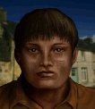

---
status: planned
priority: medium
origin: ja2
unit_id: Jazz_Gamos
portrait_id: Gamos
affiliation: Locals
role: Scout
tier: Regular
specialization: Stealth
gender: Male
nationality: Arulco
voice_source: ja2
starting_level: 3
will: 55
salary:
  starting: 250
  increase: 200
  lv1: 100
  max: 1000
medical_deposit: none
haggling: normal
executable: false
---

# Гамос — Гамос

## Identity

| Field | RU | EN |
| --- | --- | --- |
| Name | Гамос | Гамос |
| Nick | Гамос | Gamos |
| AllCapsNick | ГАМОС | GAMOS |
| Title | Я много путешествовать | Я много путешествовать |
| Email | Gamos@arulco.reb | Gamos@arulco.reb |
| snype_nick | travelmuch | travelmuch |

## Bio

**RU:** Статы 60–70, Wisdom 35, Marksmanship 78. Нормальный, нейтрален к команде. Дешёвый.

**EN:** EN draft: translate Bio RU at generation.

## Stats

| Stat | Value |
| --- | --- |
| Health | 65 |
| Agility | 70 |
| Dexterity | 65 |
| Strength | 65 |
| Wisdom | 35 |
| Will | 55 |
| Leadership | 20 |
| Marksmanship | 78 |
| Mechanical | 15 |
| Explosives | 10 |
| Medical | 15 |
| MaxHitPoints | 65 |
| StartingLevel | 3 |

## Perks

### StartingPerks

- (map JA2 skills to JA3 StartingPerks)
- `Jazz_Perk_Gamos`

### Named perk

| Field | Value |
| --- | --- |
| id | `Jazz_Perk_Gamos` |
| type | passive |
| DisplayName RU/EN | Тропы джунглей / Тропы джунглей |
| Description RU/EN | Быстрее вне дорог / Быстрее вне дорог |
| Mechanics | −30–50% travel time in jungle off-road/non-city (sat view). |

## Personality

- Quirks: Normal
- Likes: —
- Dislikes: —
- National hates: —
- Refusal / Haggle notes: Cheap local

## Hire

- Access: Locals
- MedicalDeposit: none; Haggling: normal; DaysUntilOnline: 0

## Inventory

- Equipment loot id: `Loot_JAZZ_Gamos`
- Presets (weights ~50/35/25/20):
  - *50: light rifle in loot, jungle pack, machete sheathed

## JA2 face reference

Лицо в портрете должно быть **похоже на этот JA2-референс** (сохранить возраст, этничность, причёску, ключевые черты):

Файл: `gamos.ja2-face.gif`

## Portrait prompt

**Rules:** no weapons in hands/on shoulder (holstered pistol only as last resort). Role via **class kit**.

**CHARACTER_DESCRIPTION:** Match JA2 face reference `gamos.ja2-face.gif` (same face identity). Local Arulco traveler, simple clothes, huge jungle backpack and machete sheathed — NO gun. Friendly simple smile.

**Preferred refs:** `MercPortraits/References/` matching gender/role

**Class kit:** Jungle backpack, sheathed machete, water gourd, worn boots

## Phrases — AIM chat

### Offline
- RU: Гамос много путешествовать — потом.
- EN: This is Gamos. Leave a message.

### GreetingAndOffer
- RU: Гамос тут.
- EN: Gamos here.

### ConversationRestart
- RU: Вернёмся к делу.
- EN: Let's get back to it.

### IdleLine
- RU: Идём?
- EN: Waiting.

### PartingWords
- RU: Хорошо, идём.
- EN: I'm in.

### RehireIntro
- RU: Контракт заканчивается. Продлеваем?
- EN: Contract's ending. Extending?

### RehireOutro
- RU: Остаюсь.
- EN: I'm staying.

### Refusals / Haggles / Mitigations / ExtraPartingWords
- Draft relationship refusals/haggles from Personality at generation time.

## Phrases — VoiceResponse

- `voice_source: ja2` — reuse legacy VO where available; RU/EN subtitle drafts for minimum slots:
  - Selection: «Гамос!» / «Gamos!»
  - AimAttack / OpponentKilled / DeathGeneral / Downed / CombatStartPlayer / LevelUp / AmmoLow / Idle — standard drafts + relationship slots.

## Wiring

| Field | Value |
| --- | --- |
| Appearance | Gamos |
| VoiceResponseId | Jazz_Gamos |
| pollyvoice | Matthew |
| Portrait | Mod/Dv3mFVN/MercPortraits/Gamos.png |
| BigPortrait | Mod/Dv3mFVN/MercPortraits/Gamos_Big.png |
| CustomEquipGear | TryEquip Handheld A/B as role requires |
| FallbackMissingVR | Ice |
| Sources | AIM sheet «Наемники из JA1/2»; origin=ja2 |

## Open blockers

- none
