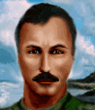

---
status: ready
priority: high
origin: nightops
unit_id: Jazz_Grom
portrait_id: Grom
affiliation: Locals
role: HeavyWeapons
tier: Veteran
specialization: HeavyWeapons
gender: Male
nationality: Russia
voice_source: nightops
starting_level: 5
will: 80
salary:
  starting: 0
  increase: 200
  lv1: 0
  max: 0
medical_deposit: none
haggling: none
executable: true
---

# Гром — Майор Сергей «Гром» Громов

## Identity

| Field | RU | EN |
| --- | --- | --- |
| Name | Майор Сергей «Гром» Громов | Major Sergei "Grom" Gromov |
| Nick | Гром | Grom |
| AllCapsNick | ГРОМ | GROM |
| Title | Афганец | The Afghan Veteran |
| Email | Grom@vvs.ru | Grom@vvs.ru |
| snype_nick | gromov | gromov |

## Bio

**RU:** Сослуживец Ивана по Afghan war. Shady Job переводит его в Night Ops. Найм: захват аэропорта и подавление местной ПВО — после этого он сам ждёт вербовщиков на лётном поле. Служит бесплатно, приходит с собственным гранатомётом. Дружит с Иваном, Игорем и Игги; недолюбливает Скоупа за манеру критиковать чужую наводку.

**EN:** A fellow Afghan-war veteran alongside Ivan. Shady Job routes him into Night Ops. Recruitment: capture the airport and knock out the nearby AA, and he'll be waiting on the tarmac for the recruiters himself. Serves for free, and brings his own rocket launcher. Friends with Ivan, Igor, and Iggy; not fond of Scope's habit of critiquing other people's aim.

## Stats

| Stat | Value |
| --- | --- |
| Health | 85 |
| Agility | 75 |
| Dexterity | 75 |
| Strength | 85 |
| Wisdom | 70 |
| Will | 80 |
| Leadership | 45 |
| Marksmanship | 75 |
| Mechanical | 67 |
| Explosives | 47 |
| Medical | 25 |
| MaxHitPoints | 85 |
| StartingLevel | 5 |

## Perks

### StartingPerks

- `Jazz_Perk_Grom`
- `HeavyWeaponsTraining`
- `Throwing`
- `Hardened`

### Named perk

| Field | Value |
| --- | --- |
| id | `Jazz_Perk_Grom` |
| type | passive |
| DisplayName RU/EN | Артподготовка / Softening Barrage |
| Description RU/EN | Первое попадание из тяжёлого оружия или бросок в ходе применяет статус «Подавление» ко всем врагам в радиусе поражения / The first heavy-weapon hit or throw each turn applies Suppressed to every enemy caught in the blast radius |
| Mechanics | Once per Grom's turn, the first successful hit from a `HeavyWeapons`-category weapon (RPG-7, launchers) or thrown explosive applies the `Suppressed` status to all enemies inside the weapon's `AreaOfEffect`, on top of normal damage/effects — reinforces `HeavyWeaponsTraining` + `Throwing` already on the sheet. |

## Personality

- Quirks: —
- Likes: Ivan, Igor (both vanilla merc ids, already shipped — Mitigation/ExtraPartingWords wiring is live immediately), Iggy (planned merc, article pending — wiring activates once ready)
- Dislikes: `Scope` (vanilla merc id, already shipped — Refusal wiring live immediately)
- National hates: none
- Refusal / Haggle notes: free hire behind a sector-capture gate; refuses only if Scope already hired

## Hire

- Access: Locals — unlocks once the player captures the airport sector and neutralizes the attached AA site; Grom then appears as a free recruit waiting at the airport
- MedicalDeposit: none; Haggling: none; DaysUntilOnline: 0

## Inventory

- Equipment loot id: `Loot_JAZZ_Grom` → `JAZZ_Grom50/35/25/20`
- *50: `JazzArmor_SovietAssaultArmor`, `RPG7`, `Warhead_Frag`×3, `AK47`, `JAZZ_AMMO_762x39_FMJ`×60 (Double), `FragGrenade`×2
- *35: `JazzArmor_SovietAssaultArmor`, `RPG7`, `Warhead_Frag`×2, `AK47`, `JAZZ_AMMO_762x39_FMJ`×60 (Double)
- *25: `JazzArmor_TireArmor`, `AK47`, `JAZZ_AMMO_762x39_FMJ`×90 (Double), `FragGrenade`×2
- *20: `JazzArmor_TireArmor`, `AK47`, `JAZZ_AMMO_762x39_FMJ`×60 (Double)

## JA2 face reference

Лицо в портрете должно быть **похоже на этот JA2-референс** (сохранить возраст, этничность, причёску, ключевые черты):

Файл: `grom.ja2-face.gif`

## Portrait prompt

**Rules:** no weapons in hands/on shoulder (holstered pistol only as last resort). Role via **class kit**.

**CHARACTER_DESCRIPTION:** Match JA2 face reference `grom.ja2-face.gif` (same face identity). Russian major ~45, weathered face, afghanka jacket, bandolier of HE rounds and launcher tube on back as silhouette prop WITHOUT aiming — prefer ammo bandolier + rangefinder, no held launcher. Calm soldier.

**Preferred refs:** `MercPortraits/References/` matching gender/role

**Class kit:** HE round bandolier, rangefinder, major shoulder boards, Afghan jacket

## Phrases — AIM chat

### Offline
- RU: Громов. Связь позже — сейчас занят проверкой боекомплекта.
- EN: Gromov. Contact later — busy checking the ammo load right now.

### GreetingAndOffer
- RU: Майор Громов. Аэродром ваш — значит, и я ваш.
- EN: Major Gromov. The airfield's yours — so am I.

### ConversationRestart
- RU: Связь прервалась. Продолжайте, товарищ.
- EN: Line dropped. Continue, comrade.

### IdleLine
- RU: Жду приказа. Гранатомёт заряжен.
- EN: Awaiting orders. Launcher's loaded.

### PartingWords
- RU: Гранатомёт с собой. Идём.
- EN: Rocket launcher's with me. Let's move.

### RehireIntro
- RU: Контракт заканчивается. Я всё равно бесплатный — продолжаем службу?
- EN: Contract's ending. I'm free of charge regardless — continuing service?

### RehireOutro
- RU: Остаюсь. Служба есть служба.
- EN: I'm staying. Duty is duty.

### Refusals
- Scope hired RU: Пока Скоуп у вас — нет. Он вечно критикует чужую наводку, а я его слышать не хочу.
- Scope hired EN: Not while Scope's with you. He never stops critiquing other people's aim, and I'm done listening.

### Mitigations
- Ivan/Igor/Iggy hired RU: Иван, Игорь или Игги уже здесь? Тогда своих не бросаю.
- Ivan/Igor/Iggy hired EN: Ivan, Igor, or Iggy already here? Then I don't abandon my own.

### ExtraPartingWords
- RU: Найдёте Ивана или Игоря — берите без раздумий, проверенные бойцы.
- EN: If you find Ivan or Igor — take them without hesitation, proven soldiers.

## Phrases — VoiceResponse

- `voice_source: nightops` — reuse legacy VO where available; RU/EN subtitle drafts for minimum slots:
  - Selection: «Майор Громов на позиции.» / «Major Gromov in position.»
  - AimAttack (1): «Огонь по цели!» / «Fire on target!»
  - AimAttack (2): «Гранатомёт готов.» / «Launcher ready.»
  - OpponentKilled: «Цель уничтожена.» / «Target destroyed.»
  - DeathGeneral: «Держитесь, ребята...» / «Hold the line, men...»
  - Downed: «Ранен, но держу оружие.» / «Wounded, still holding the weapon.»
  - CombatStartDetected: «Противник на подходе, к бою!» / «Enemy approaching, stand to!»
  - LevelUp: «Опыт Афгана не забывается.» / «Afghan experience doesn't fade.»
  - AmmoLow: «Заряды на исходе!» / «Running low on rounds!»
  - Idle: «Жду приказа, майор наготове.» / «Awaiting orders, major's ready.»
  - MockDislike (Scope): «Скоуп бы тут что-то поправил, наверное.» / «Scope would probably find something to fix here.»
  - Praises (Ivan/Igor/Iggy present): «Хорошо служить со своими.» / «Good to serve alongside my own.»

## Wiring

| Field | Value |
| --- | --- |
| Appearance | Grom |
| VoiceResponseId | Jazz_Grom |
| pollyvoice | Matthew |
| Portrait | Mod/Dv3mFVN/MercPortraits/Grom.png |
| BigPortrait | Mod/Dv3mFVN/MercPortraits/Grom_Big.png |
| CustomEquipGear | TryEquip Handheld A/B Firearm |
| FallbackMissingVR | Ice |
| Sources | AIM sheet «Наемники из JA1/2»; origin=nightops |

## Open blockers

- none
