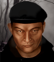

# Хеннинг — Хеннинг фон Браниц

## Identity

| Field | RU | EN |
| --- | --- | --- |
| Name | Хеннинг фон Браниц | Henning von Branitz |
| Nick | Хеннинг | Henning |
| AllCapsNick | ХЕННИНГ | HENNING |
| Title | Барон-гасс | The Cabinet General |
| Email | Henning@aim.com | Henning@aim.com |
| snype_nick | vonbranitz | vonbranitz |

## Bio

**RU:** Wildfire — эрзац-замена Гасу. Статы 70–80, Wisdom 96, Leadership 76, Marksmanship 92. Клаустрофоб, не переносит замкнутые помещения. Аристократичный тактик, предпочитает командовать издалека, но не боится взять оружие сам, если требуется. Дружит со Штайгером и Лорой; недолюбливает Тора и Рикошета.

**EN:** Wildfire — an ersatz stand-in for Gus. Stats 70-80, 96 Wisdom, 76 Leadership, 92 Marksmanship. A claustrophobe who can't stand enclosed spaces. An aristocratic tactician who prefers commanding from a distance but won't hesitate to pick up a weapon himself when needed. Friends with Steiger and Laura; doesn't get along with Thor or Ricochet.

## Stats

| Stat | Value |
| --- | --- |
| Health | 78 |
| Agility | 70 |
| Dexterity | 75 |
| Strength | 75 |
| Wisdom | 96 |
| Will | 85 |
| Leadership | 76 |
| Marksmanship | 92 |
| Mechanical | 35 |
| Explosives | 35 |
| Medical | 35 |
| MaxHitPoints | 78 |
| StartingLevel | 5 |

## Perks

### StartingPerks

- `Jazz_Perk_Henning`
- `AutoWeapons`
- `HeavyWeaponsTraining`
- `LeadFromTheFront`

### Named perk

| Field | Value |
| --- | --- |
| id | `Jazz_Perk_Henning` |
| type | passive |
| DisplayName RU/EN | Кабинетный генерал / The Cabinet General |
| Description RU/EN | Приказы Хеннинга усиливают ближайших союзников / Henning's orders strengthen nearby allies |
| Mechanics | At the start of each of Henning's turns, all allied units within 5 tiles gain +5 to CTH for their next attack this turn, reflecting his aristocratic command presence — stacks with `LeadFromTheFront` for a genuine battlefield-commander archetype. |

## Personality

- Quirks: Claustrophobic (flavor only — JA3 has no indoor/claustrophobia penalty system, not implemented as a StartingPerk or hire condition)
- Likes: `Jazz_Steiger`, `Jazz_Laura` (both planned mercs — Mitigation/ExtraPartingWords wiring activates once ready)
- Dislikes: `Thor` (vanilla merc id, already shipped — Refusal wiring live immediately), `Jazz_Ricochet` (planned merc — Refusal wiring activates once ready)
- National hates: none
- Refusal / Haggle notes: refuses if Thor hired; standard AIM money/death-toll refusals; mitigation if Steiger or Laura hired; expensive hire befitting his aristocratic background

## Hire

- Access: AIM roster (Wildfire origin)
- MedicalDeposit: large; Haggling: high; DaysUntilOnline: 0

## Inventory

- Equipment loot id: `Loot_JAZZ_Henning` → `JAZZ_Henning50/35/25/20`
- *50: `JazzArmor_Uniform`, `Sig550`, `JAZZ_AMMO_556_FMJ`×80 (Double), `FirstAidKit`, `Meds`×20
- *35: `JazzArmor_Uniform`, `Sig550`, `JAZZ_AMMO_556_FMJ`×60 (Double), `Meds`×10
- *25: `JazzArmor_LeatherJacketBrn`, `M16A1`, `JAZZ_AMMO_556_FMJ`×60 (Double)
- *20: `JazzArmor_LeatherJacketBrn`, `M16A1`, `JAZZ_AMMO_556_FMJ`×40 (Double)

## JA2 face reference

Лицо в портрете должно быть **похоже на этот JA2-референс** (сохранить возраст, этничность, причёску, ключевые черты):

Файл: `henning.ja2-face.gif`

## Portrait prompt

**Rules:** no weapons in hands/on shoulder (holstered pistol only as last resort). Role via **class kit**.

**CHARACTER_DESCRIPTION:** Match JA2 face reference `henning.ja2-face.gif` (same face identity). Aristocratic German commander ~45, thin mustache, pipe and map case — NO gun. Calm, commanding presence.

**Preferred refs:** `MercPortraits/References/` matching gender/role

**Class kit:** Pipe, map case, officer coat, reading glasses

## Phrases — AIM chat

### Offline
- RU: Фон Браниц отсутствует. Позже.
- EN: Von Branitz is unavailable. Later.

### GreetingAndOffer
- RU: Хеннинг слушает. Излагайте.
- EN: Henning here. State your business.

### ConversationRestart
- RU: Связь прервалась. Продолжайте, пожалуйста.
- EN: Line dropped. Please continue.

### IdleLine
- RU: Жду распоряжений.
- EN: Awaiting instructions.

### PartingWords
- RU: Принято. Я в вашем распоряжении.
- EN: Understood. I'm at your disposal.

### RehireIntro
- RU: Контракт заканчивается. Продлеваем?
- EN: Contract's ending. Extending?

### RehireOutro
- RU: Остаюсь. Здесь ещё есть кем командовать.
- EN: I'm staying. Still men here worth commanding.

### Refusals
- Thor hired RU: Пока Тор в отряде — нет. Не нахожу с ним общего языка.
- Thor hired EN: Not while Thor's on the team. We simply don't see eye to eye.
- Death toll RU: Слишком много потерь для моих стандартов командования.
- Death toll EN: Too many losses for my standards of command.

### Mitigations
- Steiger/Laura hired RU: Штайгер или Лора уже здесь? Тогда я готов присоединиться.
- Steiger/Laura hired EN: Steiger or Laura already here? Then I'm ready to join.

### ExtraPartingWords
- RU: Найдёте Штайгера — берите. Дисциплинированный солдат.
- EN: If you find Steiger — take him. A disciplined soldier.

## Phrases — VoiceResponse

- `voice_source: wildfire` — reuse legacy VO where available; RU/EN subtitle drafts for minimum slots:
  - Selection: «Хеннинг на позиции.» / «Henning in position.»
  - AimAttack (1): «Цель обозначена.» / «Target designated.»
  - AimAttack (2): «Огонь, по моей команде.» / «Fire, on my command.»
  - OpponentKilled: «Приказ исполнен.» / «Order executed.»
  - DeathGeneral: «Командование... переходит...» / «Command... passes on...»
  - Downed: «Ранен, но командование продолжается.» / «Wounded, but command continues.»
  - CombatStartDetected: «Противник обнаружен, всем занять позиции!» / «Enemy detected, everyone take positions!»
  - LevelUp: «Опыт командования растёт.» / «Command experience grows.»
  - AmmoLow: «Боеприпасы на исходе.» / «Ammunition running low.»
  - Idle: «Готов отдать приказ.» / «Ready to give the order.»
  - MockDislike (Thor): «Надеюсь, Тор не будет создавать проблем.» / «I hope Thor won't cause trouble.»
  - Praises (Steiger/Laura present): «С такими солдатами командовать проще.» / «It's easier to command with soldiers like these.»

## Wiring

| Field | Value |
| --- | --- |
| Appearance | Henning |
| VoiceResponseId | Jazz_Henning |
| pollyvoice | Matthew |
| Portrait | Mod/Dv3mFVN/MercPortraits/Henning.png |
| BigPortrait | Mod/Dv3mFVN/MercPortraits/Henning_Big.png |
| CustomEquipGear | TryEquip Handheld A Firearm |
| FallbackMissingVR | Ice |
| Sources | AIM sheet «Наемники из JA1/2»; origin=wildfire |

## Open blockers

- none
