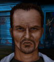

# Убийца — Ричард «Убийца» Рутвен

## Identity

| Field | RU | EN |
| --- | --- | --- |
| Name | Ричард «Убийца» Рутвен | Richard "Hitman" Ruthven |
| Nick | Убийца | Hitman |
| AllCapsNick | УБИЙЦА | HITMAN |
| Title | Разыскиваемый | The Wanted Man |
| Email | Hitman@dark.net | Hitman@dark.net |
| snype_nick | ruthven | ruthven |

## Bio

**RU:** Статы 75–80, Wisdom 59, Marksmanship 93. Разыскиваемый террорист-наёмник — берёт контракт бесплатно, чтобы отсидеться неделю, а затем скрывается. Не умеет плавать. Уважает Мэджика; терпеть не может Фло; недолюбливает американцев.

**EN:** Stats in the 75-80 range, 59 Wisdom, 93 Marksmanship. A wanted mercenary terrorist who takes the contract for free just to lie low for a week before disappearing again. Can't swim. Respects Magic; can't stand Flo; not fond of Americans.

## Stats

| Stat | Value |
| --- | --- |
| Health | 78 |
| Agility | 75 |
| Dexterity | 80 |
| Strength | 75 |
| Wisdom | 59 |
| Will | 55 |
| Leadership | 20 |
| Marksmanship | 93 |
| Mechanical | 20 |
| Explosives | 20 |
| Medical | 10 |
| MaxHitPoints | 78 |
| StartingLevel | 4 |

## Perks

### StartingPerks

- `Jazz_Perk_Hitman`
- `TakeAim`
- `SteadyBreathing`
- `DedicatedCamper`

### Named perk

| Field | Value |
| --- | --- |
| id | `Jazz_Perk_Hitman` |
| type | active |
| DisplayName RU/EN | Вырубить / Knock Out |
| Description RU/EN | Раз за миссию выстрел из винтовки вырубает вместо убийства / Once per mission, a rifle shot knocks the target out instead of killing them |
| Mechanics | Active ability, once per mission: Hitman's next rifle shot that would hit applies Unconscious to the target instead of dealing damage. The ability recharges after Hitman scores a normal (lethal) kill. |

## Personality

- Quirks: CannotSwim (bio flavor only — no matching JA3 status perk)
- Likes: `Magic`
- Dislikes: `Jazz_Flo` (planned merc — Refusal wiring activates once ready)
- National hates: Americans — Haggle trigger when the active squad is full of American-nationality mercs
- Refusal / Haggle notes: refuses if Flo hired; haggles when squad is all-American; no money refusal (works for free during his week of exposure); mitigation and recommendation for Magic when hired

## Hire

- Access: Special — exposed as a wanted man, works one free week to lie low, then leaves; hireable through the same story trigger that surfaces this event
- MedicalDeposit: none; Haggling: none; DaysUntilOnline: 0

## Inventory

- Equipment loot id: `Loot_JAZZ_Hitman` → `JAZZ_Hitman50/35/25/20`
- *50: `JazzArmor_CamoBalaclava`, `DragunovSVD`, `JAZZ_AMMO_762x54_Match`×20 (Double), `US_Passport`
- *35: `PSG1`, `JAZZ_AMMO_308_Match`×20 (Double)
- *25: `M24Sniper`, `JAZZ_AMMO_308_FMJ`×16 (Double)
- *20: `SKS`, `JAZZ_AMMO_762x39_FMJ`×16 (Double)

## JA2 face reference

Лицо в портрете должно быть **похоже на этот JA2-референс** (сохранить возраст, этничность, причёску, ключевые черты):

Файл: `hitman.ja2-face.gif`

## Portrait prompt

**Rules:** no weapons in hands/on shoulder (holstered pistol only as last resort). Role via **class kit**. Face must match JA2 reference above.

**CHARACTER_DESCRIPTION:** Match JA2 face reference `hitman.ja2-face.gif` (same face identity). Wanted sniper ~35, hoodie, spotting monocle on a strap — NO rifle in hands. Cold, guarded stare.

**Preferred refs:** `MercPortraits/References/` matching gender/role

**Class kit:** Hoodie, spotting monocle, fake-ID pouch

## Phrases — AIM chat

### Offline
- RU: ...
- EN: ...

### GreetingAndOffer
- RU: Говори быстро.
- EN: Talk fast.

### ConversationRestart
- RU: Связь прервалась. Вернёмся к делу.
- EN: Line dropped. Let's get back to it.

### IdleLine
- RU: Время идёт.
- EN: Time's moving.

### PartingWords
- RU: Неделя. Не больше.
- EN: One week. No more.

### RehireIntro
- RU: Контракт заканчивается. Продлеваем?
- EN: Contract's ending. Extending?

### RehireOutro
- RU: Остаюсь ещё немного.
- EN: I'll stay a bit longer.

### Refusals
- Flo hired RU: Пока Фло в отряде — я пас.
- Flo hired EN: Not while Flo's on the team.

### Haggles
- American mercs hired RU: Отряд полон американцев... ладно, но на моих условиях.
- American mercs hired EN: Squad's full of Americans... fine, but on my terms.

### Mitigations
- Magic hired RU: Мэджик уже здесь? Тогда порядок.
- Magic hired EN: Magic's already in? Then we're good.

## Phrases — VoiceResponse

- `voice_source: ja2` — reuse legacy VO where available; RU/EN subtitle drafts for minimum slots:
  - Selection: «Готов.» / «Ready.»
  - AimAttack (1): «Цель зафиксирована.» / «Target locked.»
  - AimAttack (2): «Одним выстрелом.» / «One shot.»
  - OpponentKilled: «Готово.» / «Done.»
  - DeathGeneral: «Не в этот раз...» / «Not this time...»
  - Downed: «Ранен.» / «Hit.»
  - CombatStartDetected: «Заметили.» / «Spotted.»
  - LevelUp: «Ещё точнее.» / «Even sharper now.»
  - AmmoLow: «Патроны на исходе.» / «Running low on ammo.»
  - Idle: «Жду.» / «Waiting.»
  - MockDislike (Flo): «Хорошо, что Фло тут нет.» / «Good thing Flo's not here.»

## Wiring

| Field | Value |
| --- | --- |
| Appearance | Hitman |
| VoiceResponseId | Jazz_Hitman |
| pollyvoice | Matthew |
| Portrait | Mod/Dv3mFVN/MercPortraits/Hitman.png |
| BigPortrait | Mod/Dv3mFVN/MercPortraits/Hitman_Big.png |
| CustomEquipGear | TryEquip Handheld A Firearm |
| FallbackMissingVR | Ice |
| Sources | AIM sheet «Наемники из JA1/2»; origin=ja2 |

## Open blockers

- none
