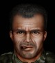

---
status: planned
priority: medium
origin: ub
unit_id: Jazz_Horg
portrait_id: Horg
affiliation: MERC
role: HeavyWeapons
tier: Veteran
specialization: HeavyWeapons
gender: Male
nationality: USA
voice_source: ub
starting_level: 4
will: 60
salary:
  starting: 2700
  increase: 200
  lv1: 1100
  max: 6500
medical_deposit: standard
haggling: normal
executable: false
---

# Сигара — Лейтенант Хорг «Сигара»

## Identity

| Field | RU | EN |
| --- | --- | --- |
| Name | Лейтенант Хорг «Сигара» | Лейтенант Хорг «Сигара» |
| Nick | Сигара | Horg |
| AllCapsNick | СИГАРА | HORG |
| Title | Сигара | Сигара |
| Email | Horg@merc.com | Horg@merc.com |
| snype_nick | cigar | cigar |

## Bio

**RU:** UB. Health 98, Strength 94, Agility 78, Marksmanship 89, Mech 74, Wisdom 77. Aggressive. Likes Bull, Gus, Biff; dislikes Trevor, Lava.

**EN:** EN draft: translate Bio RU at generation.

## Stats

| Stat | Value |
| --- | --- |
| Health | 98 |
| Agility | 78 |
| Dexterity | 75 |
| Strength | 94 |
| Wisdom | 77 |
| Will | 60 |
| Leadership | 35 |
| Marksmanship | 89 |
| Mechanical | 74 |
| Explosives | 50 |
| Medical | 20 |
| MaxHitPoints | 98 |
| StartingLevel | 4 |

## Perks

### StartingPerks

- (map JA2 skills to JA3 StartingPerks)
- `Jazz_Perk_Horg`

### Named perk

| Field | Value |
| --- | --- |
| id | `Jazz_Perk_Horg` |
| type | passive |
| DisplayName RU/EN | Тяжёлая рука / Тяжёлая рука |
| Description RU/EN | Expert heavy weapons / Expert heavy weapons |
| Mechanics | HeavyWeaponsTraining expert bonuses (recoil/AP). needs-design. |

## Personality

- Quirks: Aggressive
- Likes: Jazz_Bull, Gus, Biff
- Dislikes: Jazz_Colby, Lava
- National hates: —
- Refusal / Haggle notes: UB

## Hire

- Access: MERC
- MedicalDeposit: standard; Haggling: normal; DaysUntilOnline: 0

## Inventory

- Equipment loot id: `Loot_JAZZ_Horg`
- Presets (weights ~50/35/25/20):
  - *50: GL/ammo in loot, cigar, heavy vest

## JA2 face reference

Лицо в портрете должно быть **похоже на этот JA2-референс** (сохранить возраст, этничность, причёску, ключевые черты):

Файл: `horg.ja2-face.jpg`

## Portrait prompt

**Rules:** no weapons in hands/on shoulder (holstered pistol only as last resort). Role via **class kit**.

**CHARACTER_DESCRIPTION:** Match JA2 face reference `horg.ja2-face.jpg` (same face identity). Huge American LT with cigar, heavy flak vest and grenade bandolier — NO launcher in hands. Aggressive grin.

**Preferred refs:** `MercPortraits/References/` matching gender/role

**Class kit:** Cigar, grenade bandolier, heavy flak, LT bars

## Phrases — AIM chat

### Offline
- RU: Сигара курит. Потом.
- EN: This is Horg. Leave a message.

### GreetingAndOffer
- RU: Хорг. Говори.
- EN: Horg here.

### ConversationRestart
- RU: Вернёмся к делу.
- EN: Let's get back to it.

### IdleLine
- RU: Ну?
- EN: Waiting.

### PartingWords
- RU: Беру тяжёлое.
- EN: I'm in.

### RehireIntro
- RU: Контракт заканчивается. Продлеваем?
- EN: Contract's ending. Extending?

### RehireOutro
- RU: Остаюсь.
- EN: I'm staying.

### Refusals / Haggles / Mitigations / ExtraPartingWords
- Draft relationship refusals/haggles from Personality at generation time.

## Phrases — VoiceResponse

- `voice_source: ub` — reuse legacy VO where available; RU/EN subtitle drafts for minimum slots:
  - Selection: «Сигара!» / «Horg!»
  - AimAttack / OpponentKilled / DeathGeneral / Downed / CombatStartPlayer / LevelUp / AmmoLow / Idle — standard drafts + relationship slots.

## Wiring

| Field | Value |
| --- | --- |
| Appearance | Horg |
| VoiceResponseId | Jazz_Horg |
| pollyvoice | Matthew |
| Portrait | Mod/Dv3mFVN/MercPortraits/Horg.png |
| BigPortrait | Mod/Dv3mFVN/MercPortraits/Horg_Big.png |
| CustomEquipGear | TryEquip Handheld A/B as role requires |
| FallbackMissingVR | Ice |
| Sources | AIM sheet «Наемники из JA1/2»; origin=ub |

## Open blockers

- perk numbers needs-design
