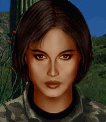

---
status: planned
priority: high
origin: ja2
unit_id: Jazz_Ira
portrait_id: Ira
affiliation: Locals
role: Commander
tier: Regular
specialization: Leader
gender: Female
nationality: USA
voice_source: ja2
starting_level: 2
will: 70
salary:
  starting: 400
  increase: 200
  lv1: 200
  max: 1500
medical_deposit: none
haggling: normal
executable: false
---

# Айра — Айра Смит

## Identity

| Field | RU | EN |
| --- | --- | --- |
| Name | Айра Смит | Айра Смит |
| Nick | Айра | Ira |
| AllCapsNick | АЙРА | IRA |
| Title | Царица ополчения | Царица ополчения |
| Email | Ira@arulco.reb | Ira@arulco.reb |
| snype_nick | givegun | givegun |

## Bio

**RU:** Слабые боевые статы и меткость 55, но для ополченцев — бог. Leadership низкий на старте, компенсируется Teacher + local. Дружит с Мигелем, Карлосом, Димитрием; не любит Злобного; не умеет плавать.

**EN:** EN draft: translate Bio RU at generation; keep tone.

## Stats

| Stat | Value |
| --- | --- |
| Health | 65 |
| Agility | 60 |
| Dexterity | 55 |
| Strength | 50 |
| Wisdom | 70 |
| Will | 70 |
| Leadership | 14 |
| Marksmanship | 55 |
| Mechanical | 20 |
| Explosives | 10 |
| Medical | 40 |
| MaxHitPoints | 65 |
| StartingLevel | 2 |

## Perks

### StartingPerks

- (map JA2 skills to JA3 StartingPerks)
- `Jazz_Perk_Ira`

### Named perk

| Field | Value |
| --- | --- |
| id | `Jazz_Perk_Ira` |
| type | passive |
| DisplayName RU/EN | Народный командир / Народный командир |
| Description RU/EN | Усиливает обучение ополчения / Усиливает обучение ополчения |
| Mechanics | Teacher expert effect: militia training speed/quality bonus (numbers TBD in implementation spec). Mark needs balance pass. |

## Personality

- Quirks: CannotSwim
- Likes: Miguel, Carlos, Dimitri
- Dislikes: Jazz_Vicious
- National hates: Americans (self-aware irony)
- Refusal / Haggle notes: Local hire

## Hire

- Access: Locals / rebel roster after contact
- MedicalDeposit: none; Haggling: normal; DaysUntilOnline: 0

## Inventory

- Equipment loot id: `Loot_JAZZ_Ira`
- Presets (weights ~50/35/25/20):
  - *50: light armor, militia radio, training manuals×2, sidearm holster kit

## JA2 face reference

Лицо в портрете должно быть **похоже на этот JA2-референс** (сохранить возраст, этничность, причёску, ключевые черты):

Файл: `ira.ja2-face.gif`

## Portrait prompt

**Rules:** no weapons in hands/on shoulder (holstered pistol only as last resort). Role via **class kit**.

**CHARACTER_DESCRIPTION:** Match JA2 face reference `ira.ja2-face.gif` (same face identity). Young determined American woman among rebels, dark hair tied back, militia instructor look, clipboard/map case and whistle on chest — NO rifle. Stern protective expression.

**Preferred refs:** `MercPortraits/References/` matching gender/role

**Class kit:** Militia instructor clipboard, map case, whistle, rebel armband

## Phrases — AIM chat

### Offline
- RU: Айра. Если это про пулемёт для ребят — говорите.
- EN: This is Ira. Leave a message.

### GreetingAndOffer
- RU: Ну? Пулемета дашь?
- EN: Ira here. Talk.

### ConversationRestart
- RU: Вернёмся к делу.
- EN: Let's get back to it.

### IdleLine
- RU: Война идёт — не мешкай.
- EN: Waiting on you.

### PartingWords
- RU: Беру своих и иду.
- EN: I'm in.

### RehireIntro
- RU: Контракт заканчивается. Продлеваем?
- EN: Contract's ending. Extending?

### RehireOutro
- RU: Остаюсь.
- EN: I'm staying.

### Refusals / Haggles / Mitigations / ExtraPartingWords
- Draft relationship refusals/haggles from Personality at generation time.

## Phrases — VoiceResponse

- `voice_source: ja2` — reuse legacy VO where available; RU/EN subtitle drafts for minimum slots:
  - Selection: «Айра!» / «Ira!»
  - AimAttack: «На мушке.» / «On target.»
  - OpponentKilled: «Готово.» / «Done.»
  - DeathGeneral: «Чёрт...» / «Damn...»
  - Downed: «Меня подбили!» / «I'm hit!»
  - CombatStartPlayer: «В бой.» / «Engage.»
  - LevelUp: «Ещё лучше.» / «Getting better.»
  - AmmoLow: «Патроны!» / «Ammo!»
  - Idle: «Жду.» / «Waiting.»
- Relationship VR slots per Likes/Dislikes when generating.

## Wiring

| Field | Value |
| --- | --- |
| Appearance | Ira |
| VoiceResponseId | Jazz_Ira |
| pollyvoice | Matthew |
| Portrait | Mod/Dv3mFVN/MercPortraits/Ira.png |
| BigPortrait | Mod/Dv3mFVN/MercPortraits/Ira_Big.png |
| CustomEquipGear | TryEquip Handheld A/B Firearm (or melee for knife mercs) |
| FallbackMissingVR | Ice |
| Sources | AIM sheet «Наемники из JA1/2»; origin=ja2 |

## Open blockers

- perk numbers: needs-design balance for militia training
- exact unlock sector/quest gate TBD
