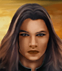

---
status: planned
priority: low
origin: wildfire
unit_id: Jazz_Laura
portrait_id: Laura
affiliation: AIM
role: Doctor
tier: Regular
specialization: Doctor
gender: Female
nationality: Romania
voice_source: wildfire
starting_level: 3
will: 55
salary:
  starting: 1700
  increase: 150
  lv1: 600
  max: 4200
medical_deposit: standard
haggling: normal
executable: false
---

# Лора — Доктор Лора Колин

## Identity

| Field | RU | EN |
| --- | --- | --- |
| Name | Доктор Лора Колин | Доктор Лора Колин |
| Nick | Лора | Laura |
| AllCapsNick | ЛОРА | LAURA |
| Title | Цыганский врач | Цыганский врач |
| Email | Laura@aim.com | Laura@aim.com |
| snype_nick | laura | laura |

## Bio

**RU:** WF. Romanian Roma woman. Stats 70–80, Agility 67, Marksmanship 82, Medical 57 (doctor!), Explosives 52 (highest WF). Fear heat. Likes Rudolf, Monk; dislikes Tosca, Fox.

**EN:** EN draft: translate Bio RU.

## Stats

| Stat | Value |
| --- | --- |
| Health | 75 |
| Agility | 67 |
| Dexterity | 75 |
| Strength | 70 |
| Wisdom | 70 |
| Will | 55 |
| Leadership | 30 |
| Marksmanship | 82 |
| Mechanical | 20 |
| Explosives | 52 |
| Medical | 57 |
| MaxHitPoints | 75 |
| StartingLevel | 3 |

## Perks

### StartingPerks

- (map JA2 skills)`n- named perk below

### Named perk

| Field | Value |
| --- | --- |
| id | `Jazz_Perk_Laura` |
| type | passive |
| DisplayName RU/EN | Скрытный врач / Скрытный врач |
| Description RU/EN | Stealth + auto / Stealth + auto |
| Mechanics | Stealthy + AutoWeapons. Medical low for doctor — intentional WF. needs-design unique. |

## Personality

- Quirks: FearHeat
- Likes: Jazz_Steiger, Jazz_Monk
- Dislikes: Jazz_Buzz, Fox
- National hates: —
- Refusal / Haggle notes: WF

## Hire

- Access: AIM
- MedicalDeposit: standard; Haggling: normal; DaysUntilOnline: 0

## Inventory

- Equipment loot id: `Loot_JAZZ_Laura`
- Presets:
  - *50: meds, stealth kit, explosives light

## JA2 face reference

Лицо в портрете должно быть **похоже на этот JA2-референс** (сохранить возраст, этничность, причёску, ключевые черты):

Файл: `laura.ja2-face.gif`

## Portrait prompt

**Rules:** no weapons in hands/on shoulder (holstered pistol only as last resort). Role via **class kit**.

**CHARACTER_DESCRIPTION:** Match JA2 face reference `laura.ja2-face.gif` (same face identity). Romanian Roma field doctor, dark hair, mixed medic and stealth pouches — NO gun. Guarded look.

**Preferred refs:** `MercPortraits/References/` matching gender/role

**Class kit:** Medic pouches, stealth wrap, explosive satchel small, scarf

## Phrases — AIM chat

### Offline
- RU: Лора недоступна.
- EN: Laura unavailable.

### GreetingAndOffer
- RU: Доктор Колин.
- EN: Laura here.

### ConversationRestart / IdleLine / PartingWords / Rehire
- Restart RU/EN: Вернёмся к делу. / Let's get back to it.
- Idle RU/EN: Жарко. / Well?
- Part RU/EN: Иду. / I'm in.
- RehireIntro: Контракт заканчивается. Продлеваем? / Contract's ending. Extending?
- RehireOutro: Остаюсь. / I'm staying.

### Extra
- Draft relationship lines at generation.

## Phrases — VoiceResponse

- `voice_source: wildfire` — legacy VO reuse + minimum Selection/AimAttack/OpponentKilled/DeathGeneral/Downed/CombatStart/LevelUp/AmmoLow/Idle drafts.

## Wiring

| Field | Value |
| --- | --- |
| Appearance | Laura |
| VoiceResponseId | Jazz_Laura |
| pollyvoice | Matthew |
| Portrait / BigPortrait | Mod/Dv3mFVN/MercPortraits/Laura.png (+_Big) |
| FallbackMissingVR | Ice |
| Sources | AIM sheet JA1/2 block; origin=wildfire |

## Open blockers

- unique perk needs-design
