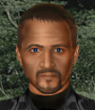

---
status: planned
priority: low
origin: wildfire
unit_id: Jazz_Lucky
portrait_id: Lucky
affiliation: AIM
role: Autorifleman
tier: Veteran
specialization: Autoriflemen
gender: Male
nationality: France
voice_source: wildfire
starting_level: 4
will: 55
salary:
  starting: 1900
  increase: 150
  lv1: 700
  max: 4500
medical_deposit: standard
haggling: normal
executable: false
---

# Лаки — Люк «Лаки» Фабр

## Identity

| Field | RU | EN |
| --- | --- | --- |
| Name | Люк «Лаки» Фабр | Люк «Лаки» Фабр |
| Nick | Лаки | Lucky |
| AllCapsNick | ЛАКИ | LUCKY |
| Title | Бельгиец | Бельгиец |
| Email | Lucky@aim.com | Lucky@aim.com |
| snype_nick | lucky | lucky |

## Bio

**RU:** WF. Belgian francophone tagged French. Stats 75–80, Leadership 58, Marksmanship 88. Likes Barry; dislikes Vicious, Foxbuns?.

**EN:** EN draft: translate Bio RU.

## Stats

| Stat | Value |
| --- | --- |
| Health | 78 |
| Agility | 75 |
| Dexterity | 75 |
| Strength | 75 |
| Wisdom | 70 |
| Will | 55 |
| Leadership | 58 |
| Marksmanship | 88 |
| Mechanical | 30 |
| Explosives | 25 |
| Medical | 25 |
| MaxHitPoints | 78 |
| StartingLevel | 4 |

## Perks

### StartingPerks

- (map JA2 skills)`n- named perk below

### Named perk

| Field | Value |
| --- | --- |
| id | `Jazz_Perk_Lucky` |
| type | passive |
| DisplayName RU/EN | Авто + рукопашка / Авто + рукопашка |
| Description RU/EN | Auto + melee / Auto + melee |
| Mechanics | AutoWeapons + MartialArts. needs-design unique. |

## Personality

- Quirks: —
- Likes: Barry
- Dislikes: Jazz_Vicious, Buns
- National hates: —
- Refusal / Haggle notes: WF

## Hire

- Access: AIM
- MedicalDeposit: standard; Haggling: normal; DaysUntilOnline: 0

## Inventory

- Equipment loot id: `Loot_JAZZ_Lucky`
- Presets:
  - *50: auto + melee kit

## JA2 face reference

Лицо в портрете должно быть **похоже на этот JA2-референс** (сохранить возраст, этничность, причёску, ключевые черты):

Файл: `lucky.ja2-face.gif`

## Portrait prompt

**Rules:** no weapons in hands/on shoulder (holstered pistol only as last resort). Role via **class kit**.

**CHARACTER_DESCRIPTION:** Match JA2 face reference `lucky.ja2-face.gif` (same face identity). Lucky Belgian-French auto trooper, grin, ammo pouches and knuckle wrap — NO gun.

**Preferred refs:** `MercPortraits/References/` matching gender/role

**Class kit:** Ammo pouches, knuckle wrap, lucky coin

## Phrases — AIM chat

### Offline
- RU: Лаки недоступен.
- EN: Lucky unavailable.

### GreetingAndOffer
- RU: Lucky here!
- EN: Lucky here.

### ConversationRestart / IdleLine / PartingWords / Rehire
- Restart RU/EN: Вернёмся к делу. / Let's get back to it.
- Idle RU/EN: Ha! / Well?
- Part RU/EN: Allons-y! / I'm in.
- RehireIntro: Контракт заканчивается. Продлеваем? / Contract's ending. Extending?
- RehireOutro: Остаюсь. / I'm staying.

### Extra
- Draft relationship lines at generation.

## Phrases — VoiceResponse

- `voice_source: wildfire` — legacy VO reuse + minimum Selection/AimAttack/OpponentKilled/DeathGeneral/Downed/CombatStart/LevelUp/AmmoLow/Idle drafts.

## Wiring

| Field | Value |
| --- | --- |
| Appearance | Lucky |
| VoiceResponseId | Jazz_Lucky |
| pollyvoice | Matthew |
| Portrait / BigPortrait | Mod/Dv3mFVN/MercPortraits/Lucky.png (+_Big) |
| FallbackMissingVR | Ice |
| Sources | AIM sheet JA1/2 block; origin=wildfire |

## Open blockers

- unique perk needs-design
