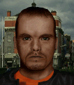

---
status: ready
priority: high
origin: ja2
unit_id: Jazz_Madman
portrait_id: Madman
affiliation: MERC
role: Mechanic
tier: Veteran
specialization: Mechanic
gender: Male
nationality: USA
voice_source: ja2
starting_level: 4
will: 50
salary:
  starting: 900
  increase: 200
  lv1: 400
  max: 2500
medical_deposit: none
haggling: none
executable: true
---

# Бешеный — Кевин «Бешеный» Камерон

## Identity

| Field | RU | EN |
| --- | --- | --- |
| Name | Кевин «Бешеный» Камерон | Kevin "Madman" Cameron |
| Nick | Бешеный | Madman |
| AllCapsNick | БЕШЕНЫЙ | MADMAN |
| Title | Ржавый бампер | The Rusty Bumper |
| Email | Madman@merc.com | Madman@merc.com |
| snype_nick | bumper | bumper |

## Bio

**RU:** Алмаз среди местных: физикалы за 90, механика 68, псих без страха. Клеится к Лиске при каждом удобном случае. После кампании в Арулько готов уйти в MERC — дёшево, лишь бы была движуха и техника под рукой.

**EN:** A diamond among the locals: physicals in the 90s, 68 Mechanical, a fearless psycho. Flirts with Fox at every chance he gets. After the Arulco campaign he's ready to move to MERC — cheap hire, as long as there's action and something mechanical to wreck or fix.

## Stats

| Stat | Value |
| --- | --- |
| Health | 92 |
| Agility | 90 |
| Dexterity | 88 |
| Strength | 91 |
| Wisdom | 56 |
| Will | 50 |
| Leadership | 15 |
| Marksmanship | 70 |
| Mechanical | 68 |
| Explosives | 20 |
| Medical | 10 |
| MaxHitPoints | 92 |
| StartingLevel | 4 |

## Perks

### StartingPerks

- `Jazz_Perk_Madman`
- `Psycho`
- `MrFixit`
- `MeleeTraining`
- `CQCTraining`
- `Ironclad`

### Named perk

| Field | Value |
| --- | --- |
| id | `Jazz_Perk_Madman` |
| type | passive |
| DisplayName RU/EN | Штурм в упор / Point-Blank Fury |
| Description RU/EN | Убийство в упор (оружием ближнего боя или выстрелом почти в упор) даёт Воодушевление / A point-blank kill (melee or near point-blank shot) grants Inspired |
| Mechanics | On a kill at range ≤1 tile (melee weapon or point-blank firearm shot), Madman gains the `Inspired` status effect for 2 turns (extra AP-equivalent morale buff, matching the existing Inspiration system used elsewhere in JAZZ). Synergizes with `MeleeTraining`/`CQCTraining` on the sheet. |

## Personality

- Quirks: `Psycho` (StartingPerk)
- Likes: Fox (planned attempt at romance in Bio flavor; Fox is a vanilla merc — Mitigation wiring targets vanilla unit id `Fox`)
- Dislikes: none
- National hates: none
- Refusal / Haggle notes: cheap Veteran hire (`StartingSalary` 900), no medical deposit, no haggling

## Hire

- Access: Locals during the Arulco campaign, transitions to MERC roster afterward (same unit, updated affiliation flavor only — no re-hire needed)
- MedicalDeposit: none; Haggling: none; DaysUntilOnline: 0

## Inventory

- Equipment loot id: `Loot_JAZZ_Madman` → `JAZZ_Madman50/35/25/20`
- *50: `JazzArmor_LeatherArmor`, `Crowbar`, `Lockpick`, `CombatStim`×3, `Parts`×20
- *35: `JazzArmor_LeatherJacketBrn`, `Crowbar`, `Lockpick`, `Parts`×15
- *25: `JazzArmor_LeatherJacketBrn`, `Crowbar`, `Parts`×10
- *20: `JazzArmor_LeatherJacketBrn`, `Crowbar`

No firearm in any tier — Madman is strictly a crowbar-and-fists brawler-mechanic.

## JA2 face reference

Лицо в портрете должно быть **похоже на этот JA2-референс** (сохранить возраст, этничность, причёску, ключевые черты):

Файл: `madman.ja2-face.gif`

## Portrait prompt

**Rules:** no weapons in hands/on shoulder (holstered pistol only as last resort). Role via **class kit**.

**CHARACTER_DESCRIPTION:** Match JA2 face reference `madman.ja2-face.gif` (same face identity). Wild-eyed American bruiser-mechanic, grease-stained tank top under vest, huge crowbar and lockpick kit on belt — NO gun. Manic grin.

**Preferred refs:** `MercPortraits/References/` matching gender/role

**Class kit:** Crowbar, lockpick set, grease rag, dented bumper charm

## Phrases — AIM chat

### Offline
- RU: Бешеный не берёт трубку — он ею бьёт. Перезвони, если не боишься.
- EN: Madman doesn't answer the phone — he hits things with it. Call back if you're not scared.

### GreetingAndOffer
- RU: Да я лучше бампером всех перемочу! Ну, есть дело или как?
- EN: I'd rather just clobber everyone with a bumper! So, you got a job or what?

### ConversationRestart
- RU: Ты пропал, а я тут заскучал. Продолжай давай.
- EN: You dropped off, and I got bored. Keep going.

### IdleLine
- RU: Ну где драка? Мне бы уже кого-то стукнуть.
- EN: Where's the fight? I need to hit something already.

### PartingWords
- RU: Ха! Поехали крушить. Дёшево и сердито — лишь бы весело было.
- EN: Ha! Let's go smash stuff. Cheap and nasty — as long as it's fun.

### RehireIntro
- RU: Контракт заканчивается — продлеваем, или сам пойду кого-нибудь чинить?
- EN: Contract's up — renewing, or do I wander off and fix somebody else's junk?

### RehireOutro
- RU: Остаюсь. Тут ещё есть что чинить и кого бить.
- EN: I'm staying. Still stuff to fix and people to hit.

### Mitigations
- Fox hired RU: О, Лиска с вами? Ну тогда я точно остаюсь, хе-хе.
- Fox hired EN: Oh, Fox is with you? Then I'm definitely staying, heh.

### ExtraPartingWords
- RU: Если увидите Лиску — скажите, что Бешеный спрашивал.
- EN: If you see Fox — tell her Madman was asking about her.

## Phrases — VoiceResponse

- `voice_source: ja2` — reuse legacy VO where available; RU/EN subtitle drafts for minimum slots:
  - Selection: «Бешеный готов крушить!» / «Madman's ready to smash!»
  - AimAttack (1): «А ну иди сюда!» / «Get over here!»
  - AimAttack (2): «Бампером по башке!» / «Bumper to the skull!»
  - OpponentKilled: «Красота!» / «Beautiful!»
  - DeathGeneral: «Не так я хотел кончить...» / «Not how I wanted to go out...»
  - Downed: «Меня приложило! Ха, но норм!» / «I got clocked! Ha, but I'm fine!»
  - CombatStartPlayer: «ДА! Наконец-то!» / «YES! Finally!»
  - LevelUp: «Ещё крепче стал!» / «Even tougher now!»
  - NoAmmo: «Патроны? Кому они нужны!» / «Ammo? Who needs it!»
  - Idle: «Скучно! Дай мне что-нибудь сломать.» / «Boring! Give me something to break.»
  - Praises (Fox present): «Лиска рядом — день удался.» / «Fox is around — good day.»

## Wiring

| Field | Value |
| --- | --- |
| Appearance | Madman |
| VoiceResponseId | Jazz_Madman |
| pollyvoice | Matthew |
| Portrait | Mod/Dv3mFVN/MercPortraits/Madman.png |
| BigPortrait | Mod/Dv3mFVN/MercPortraits/Madman_Big.png |
| CustomEquipGear | TryEquip Handheld A/B Melee (crowbar-first, no ranged default) |
| FallbackMissingVR | Ice |
| Sources | AIM sheet «Наемники из JA1/2»; origin=ja2 |

## Open blockers

- none
