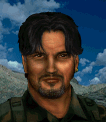

# Мигель — Мигель Кордона

## Identity

| Field | RU | EN |
| --- | --- | --- |
| Name | Мигель Кордона | Miguel Cordona |
| Nick | Мигель | Miguel |
| AllCapsNick | МИГЕЛЬ | MIGUEL |
| Title | Команданте | El Comandante |
| Email | Miguel@arulco.reb | Miguel@arulco.reb |
| snype_nick | comandante | comandante |

## Bio

**RU:** Статы 70–80, Leadership 98 — лучший лидер повстанцев Арулько, прошедший ночные операции и рукопашный бой. Дружит с Карлосом, Айрой и Тенью; не сходится характером с неким Игги (упоминание из JA2, персонаж пока не заведён в моде); недолюбливает немцев за колониальное наследие.

**EN:** Stats in the 70-80 range, 98 Leadership — the best rebel leader Arulco has, trained in night operations and hand-to-hand combat. Friends with Carlos, Ira, and Shadow; doesn't get along with someone named Iggy (JA2 mention, not yet a character in this mod); dislikes Germans over the colonial legacy.

## Stats

| Stat | Value |
| --- | --- |
| Health | 80 |
| Agility | 75 |
| Dexterity | 70 |
| Strength | 75 |
| Wisdom | 80 |
| Will | 80 |
| Leadership | 98 |
| Marksmanship | 70 |
| Mechanical | 30 |
| Explosives | 30 |
| Medical | 35 |
| MaxHitPoints | 80 |
| StartingLevel | 4 |

## Perks

### StartingPerks

- `Jazz_Perk_Miguel`
- `Teacher`
- `LeadFromTheFront`
- `NightOps`
- `MeleeTraining`

### Named perk

| Field | Value |
| --- | --- |
| id | `Jazz_Perk_Miguel` |
| type | passive |
| DisplayName RU/EN | Команданте / El Comandante |
| Description RU/EN | Пока Мигель гарнизоном стоит в секторе с ополчением, оно получает бонус к прочности и меткости; при бою вместе с ополчением все ополченцы получают дополнительное очко действия в начале боя / While Miguel is garrisoned in a sector with militia, that militia gains bonus durability and accuracy; when he fights alongside militia, all militia in that fight gain an extra AP at combat start |
| Mechanics | Aura effect: militia stationed in Miguel's home sector gain +10 max HP and +5 Marksmanship for as long as he remains garrisoned there (ends when he leaves). Separately, if Miguel is present in a combat encounter alongside militia, every militia unit on his side gets +1 free AP-equivalent action at the very start of that combat. |

## Personality

- Quirks: —
- Likes: `Jazz_Carlos` (planned merc — Mitigation/ExtraPartingWords wiring activates once ready), `Jazz_Ira` (high wave — live once Ira is generated), `Shadow`
- Dislikes: Iggy mentioned in JA2 lore is Bio flavor only — not a valid unit id in this mod, so not wired as a hard Refusal
- National hates: Germans — Haggle trigger, same pattern as Colby/Conrad's Americans haggle
- Refusal / Haggle notes: standard Locals money/death-toll refusals; haggles when squad is full of German mercs; mitigation if Carlos, Ira, or Shadow hired

## Hire

- Access: Locals — unlocked after making contact with the Arulco resistance cell holding Miguel's home sector
- MedicalDeposit: small; Haggling: normal; DaysUntilOnline: 0

## Inventory

- Equipment loot id: `Loot_JAZZ_Miguel` → `JAZZ_Miguel50/35/25/20`
- *50: `JazzArmor_Uniform`, `HiPower`, `JAZZ_AMMO_9x19_FMJ`×32 (Double), `FirstAidKit`, `Meds`×10
- *35: `JazzArmor_LeatherJacketBrn`, `Colt1911`, `JAZZ_AMMO_45ACP_FMJ`×28 (Double)
- *25: `JazzArmor_LeatherJacketBrn`, `P210`, `JAZZ_AMMO_9x19_FMJ`×40 (Double)
- *20: `JazzArmor_LeatherJacketBrn`, `Makarov`, `JAZZ_AMMO_9x18_FMJ`×24 (Double)

## JA2 face reference

Лицо в портрете должно быть **похоже на этот JA2-референс** (сохранить возраст, этничность, причёску, ключевые черты):

Файл: `miguel.ja2-face.gif`

## Portrait prompt

**Rules:** no weapons in hands/on shoulder (holstered pistol only as last resort). Role via **class kit**.

**CHARACTER_DESCRIPTION:** Match JA2 face reference `miguel.ja2-face.gif` (same face identity). Charismatic Arulco rebel leader ~40, mustache, command coat with radio and folded map — holstered pistol OK. Determined, confident expression.

**Preferred refs:** `MercPortraits/References/` matching gender/role

**Class kit:** Command radio, map case, rebel sash, holstered pistol

## Phrases — AIM chat

### Offline
- RU: Мигель. Оставьте сообщение для дела свободы Арулько.
- EN: This is Miguel. Leave a message for the cause of Arulco's freedom.

### GreetingAndOffer
- RU: Говорит Мигель. Слушаю.
- EN: Miguel speaking. I'm listening.

### ConversationRestart
- RU: Связь прервалась. Вернёмся к делу.
- EN: Line dropped. Let's get back to it.

### IdleLine
- RU: Арулько ждёт. Не задерживайся.
- EN: Arulco is waiting. Don't dawdle.

### PartingWords
- RU: Встаём в строй. Пора действовать.
- EN: Falling in line. Time to act.

### RehireIntro
- RU: Контракт заканчивается. Продлеваем?
- EN: Contract's ending. Extending?

### RehireOutro
- RU: Остаюсь. Освобождение ещё не закончено.
- EN: I'm staying. The liberation isn't finished yet.

### Haggles
- German mercs hired RU: Отряд полон немцев... Ладно, но с доплатой — старые счёты не забываются.
- German mercs hired EN: Your squad's full of Germans... Fine, but it'll cost extra — old scores aren't forgotten.

### Mitigations
- Carlos/Ira/Shadow hired RU: Карлос, Айра или Тень уже с вами? Тогда я вам доверяю.
- Carlos/Ira/Shadow hired EN: Carlos, Ira, or Shadow already with you? Then I trust you.

### ExtraPartingWords
- RU: Найдёте Карлоса или Айру — берите без раздумий, это наши лучшие люди.
- EN: If you find Carlos or Ira, take them without hesitation — our best people.

## Phrases — VoiceResponse

- `voice_source: ja2` — reuse legacy VO where available; RU/EN subtitle drafts for minimum slots:
  - Selection: «Мигель здесь!» / «Miguel's here!»
  - AimAttack (1): «За Арулько!» / «For Arulco!»
  - AimAttack (2): «Держим строй!» / «Hold the line!»
  - OpponentKilled: «Один меньше.» / «One less.»
  - DeathGeneral: «Простите, друзья...» / «Forgive me, my friends...»
  - Downed: «Ранен — прикройте меня!» / «I'm hit — cover me!»
  - CombatStartDetected: «К оружию, товарищи!» / «To arms, comrades!»
  - LevelUp: «Опыт куётся в бою.» / «Experience is forged in battle.»
  - AmmoLow: «Патроны на исходе!» / «Running low on ammo!»
  - Idle: «Жду сигнала.» / «Waiting for the signal.»
  - Praises (Carlos/Ira/Shadow present): «Рад драться рядом со своими.» / «Good to fight beside my own.»

## Wiring

| Field | Value |
| --- | --- |
| Appearance | Miguel |
| VoiceResponseId | Jazz_Miguel |
| pollyvoice | Matthew |
| Portrait | Mod/Dv3mFVN/MercPortraits/Miguel.png |
| BigPortrait | Mod/Dv3mFVN/MercPortraits/Miguel_Big.png |
| CustomEquipGear | TryEquip Handheld A Firearm |
| FallbackMissingVR | Ice |
| Sources | AIM sheet «Наемники из JA1/2»; origin=ja2 |

## Open blockers

- none
