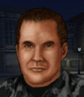

---
status: planned
priority: high
origin: nightops
unit_id: Jazz_Mike
portrait_id: Mike
affiliation: AIM
role: AllRounder
tier: Elite
specialization: AllRounder
gender: Male
nationality: USA
voice_source: nightops
starting_level: 6
will: 85
salary:
  starting: 4000
  increase: 200
  lv1: 2000
  max: 9000
medical_deposit: large
haggling: normal
executable: false
---

# Майк — Майк

## Identity

| Field | RU | EN |
| --- | --- | --- |
| Name | Майк | Майк |
| Nick | Майк | Mike |
| AllCapsNick | МАЙК | MIKE |
| Title | Старый друг | Старый друг |
| Email | Mike@aim.com | Mike@aim.com |
| snype_nick | oldfriend | oldfriend |

## Bio

**RU:** Классика JA1. В Night Ops — перевербовка AIM в бою; в 1.13 — AIM hire в модах. Одиночка. Планируется дружба с Лысым, вражда с Гасом и Иваном; русская озвучка до уровня JA3.

**EN:** EN draft: translate Bio RU at generation; keep tone.

## Stats

| Stat | Value |
| --- | --- |
| Health | 90 |
| Agility | 85 |
| Dexterity | 85 |
| Strength | 85 |
| Wisdom | 80 |
| Will | 85 |
| Leadership | 50 |
| Marksmanship | 90 |
| Mechanical | 40 |
| Explosives | 40 |
| Medical | 40 |
| MaxHitPoints | 90 |
| StartingLevel | 6 |

## Perks

### StartingPerks

- (map JA2 skills to JA3 StartingPerks)
- `Jazz_Perk_Mike`

### Named perk

| Field | Value |
| --- | --- |
| id | `Jazz_Perk_Mike` |
| type | passive |
| DisplayName RU/EN | Быстрая реакция / Быстрая реакция |
| Description RU/EN | Night Ops + quick reaction / Night Ops + quick reaction |
| Mechanics | NightOps + QuickReaction style bonus (map to JA3 interrupt/AP on detect). Exact numbers in impl spec. |

## Personality

- Quirks: Loner
- Likes: Steroid (planned)
- Dislikes: Gus, Ivan (planned)
- National hates: —
- Refusal / Haggle notes: Special recruit

## Hire

- Access: AIM / battlefield recruit (Night Ops style gate)
- MedicalDeposit: large; Haggling: normal; DaysUntilOnline: 0

## Inventory

- Equipment loot id: `Loot_JAZZ_Mike`
- Presets (weights ~50/35/25/20):
  - *50: balanced mid-tier rifle, light armor, night ops kit

## JA2 face reference

Лицо в портрете должно быть **похоже на этот JA2-референс** (сохранить возраст, этничность, причёску, ключевые черты):

Файл: `mike.ja2-face.gif`

## Portrait prompt

**Rules:** no weapons in hands/on shoulder (holstered pistol only as last resort). Role via **class kit**.

**CHARACTER_DESCRIPTION:** Match JA2 face reference `mike.ja2-face.gif` (same face identity). Grizzled American AIM veteran, short hair, confident half-smile, night-ops goggles on helmet and reaction timer watch — NO weapon in hands. Classic merc look.

**Preferred refs:** `MercPortraits/References/` matching gender/role

**Class kit:** NV goggles on helmet, chronometer, AIM pin

## Phrases — AIM chat

### Offline
- RU: Майк. Перезвоните.
- EN: This is Mike. Leave a message.

### GreetingAndOffer
- RU: Старый друг на линии. Ну?
- EN: Mike here. Talk.

### ConversationRestart
- RU: Вернёмся к делу.
- EN: Let's get back to it.

### IdleLine
- RU: Говори.
- EN: Waiting on you.

### PartingWords
- RU: Как в старые добрые.
- EN: I'm in.

### RehireIntro
- RU: Контракт заканчивается. Продлеваем?
- EN: Contract's ending. Extending?

### RehireOutro
- RU: Остаюсь.
- EN: I'm staying.

### Refusals / Haggles / Mitigations / ExtraPartingWords
- Draft relationship refusals/haggles from Personality at generation time.

## Phrases — VoiceResponse

- `voice_source: nightops` — reuse legacy VO where available; RU/EN subtitle drafts for minimum slots:
  - Selection: «Майк!» / «Mike!»
  - AimAttack: «На мушке.» / «On target.»
  - OpponentKilled: «Готово.» / «Done.»
  - DeathGeneral: «Чёрт...» / «Damn...»
  - Downed: «Меня подбили!» / «I'm hit!»
  - CombatStartPlayer: «В бой.» / «Engage.»
  - LevelUp: «Ещё лучше.» / «Getting better.»
  - AmmoLow: «Патроны!» / «Ammo!»
  - Idle: «Жду.» / «Waiting.»
- Relationship VR slots per Likes/Dislikes when generating.

## Wiring

| Field | Value |
| --- | --- |
| Appearance | Mike |
| VoiceResponseId | Jazz_Mike |
| pollyvoice | Matthew |
| Portrait | Mod/Dv3mFVN/MercPortraits/Mike.png |
| BigPortrait | Mod/Dv3mFVN/MercPortraits/Mike_Big.png |
| CustomEquipGear | TryEquip Handheld A/B Firearm (or melee for knife mercs) |
| FallbackMissingVR | Ice |
| Sources | AIM sheet «Наемники из JA1/2»; origin=nightops |

## Open blockers

- exact recruit gate and friendship wiring: needs-design
