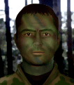

---
status: planned
priority: medium
origin: wildfire
unit_id: Jazz_Monk
portrait_id: Monk
affiliation: AIM
role: Scout
tier: Veteran
specialization: Stealth
gender: Male
nationality: Russia
voice_source: wildfire
starting_level: 4
will: 75
salary:
  starting: 2400
  increase: 200
  lv1: 1000
  max: 5500
medical_deposit: standard
haggling: normal
executable: false
---

# Монк — Виктор «Монк» Колесников

## Identity

| Field | RU | EN |
| --- | --- | --- |
| Name | Виктор «Монк» Колесников | Виктор «Монк» Колесников |
| Nick | Монк | Monk |
| AllCapsNick | МОНК | MONK |
| Title | Чеченский след | Чеченский след |
| Email | Monk@aim.com | Monk@aim.com |
| snype_nick | monk | monk |

## Bio

**RU:** Wildfire. Chechnya veteran. Dislikes motherland. Stats 80–90, Marksmanship 94, skills 20–30. Loner. Likes Laura; dislikes Ivan, Conrad.

**EN:** EN draft: translate Bio RU at generation.

## Stats

| Stat | Value |
| --- | --- |
| Health | 88 |
| Agility | 85 |
| Dexterity | 80 |
| Strength | 80 |
| Wisdom | 70 |
| Will | 75 |
| Leadership | 25 |
| Marksmanship | 94 |
| Mechanical | 25 |
| Explosives | 25 |
| Medical | 20 |
| MaxHitPoints | 88 |
| StartingLevel | 4 |

## Perks

### StartingPerks

- (map JA2 skills to JA3 StartingPerks)
- `Jazz_Perk_Monk`

### Named perk

| Field | Value |
| --- | --- |
| id | `Jazz_Perk_Monk` |
| type | passive |
| DisplayName RU/EN | Маскировка / Маскировка |
| Description RU/EN | Auto + camouflage / Auto + camouflage |
| Mechanics | AutoWeapons + camouflage stealth bonus. needs-design. |

## Personality

- Quirks: Loner
- Likes: Jazz_Laura
- Dislikes: Ivan, Jazz_Conrad
- National hates: —
- Refusal / Haggle notes: AIM WF

## Hire

- Access: AIM
- MedicalDeposit: standard; Haggling: normal; DaysUntilOnline: 0

## Inventory

- Equipment loot id: `Loot_JAZZ_Monk`
- Presets (weights ~50/35/25/20):
  - *50: camo kit, assault loadout in loot

## JA2 face reference

Лицо в портрете должно быть **похоже на этот JA2-референс** (сохранить возраст, этничность, причёску, ключевые черты):

Файл: `monk.ja2-face.gif`

## Portrait prompt

**Rules:** no weapons in hands/on shoulder (holstered pistol only as last resort). Role via **class kit**.

**CHARACTER_DESCRIPTION:** Match JA2 face reference `monk.ja2-face.gif` (same face identity). Russian special-forces look, cold eyes, camo facepaint and ghillie hood down — NO rifle. Distant.

**Preferred refs:** `MercPortraits/References/` matching gender/role

**Class kit:** Camo paint, ghillie hood, suppressor pouch (empty), knife sheathed

## Phrases — AIM chat

### Offline
- RU: Monk offline.
- EN: This is Monk. Leave a message.

### GreetingAndOffer
- RU: Monk.
- EN: Monk here.

### ConversationRestart
- RU: Вернёмся к делу.
- EN: Let's get back to it.

### IdleLine
- RU: ...
- EN: Waiting.

### PartingWords
- RU: Ok.
- EN: I'm in.

### RehireIntro
- RU: Контракт заканчивается. Продлеваем?
- EN: Contract's ending. Extending?

### RehireOutro
- RU: Остаюсь.
- EN: I'm staying.

### Refusals / Haggles / Mitigations / ExtraPartingWords
- Draft relationship refusals/haggles from Personality at generation time.

## Phrases — VoiceResponse

- `voice_source: wildfire` — reuse legacy VO where available; RU/EN subtitle drafts for minimum slots:
  - Selection: «Монк!» / «Monk!»
  - AimAttack / OpponentKilled / DeathGeneral / Downed / CombatStartPlayer / LevelUp / AmmoLow / Idle — standard drafts + relationship slots.

## Wiring

| Field | Value |
| --- | --- |
| Appearance | Monk |
| VoiceResponseId | Jazz_Monk |
| pollyvoice | Matthew |
| Portrait | Mod/Dv3mFVN/MercPortraits/Monk.png |
| BigPortrait | Mod/Dv3mFVN/MercPortraits/Monk_Big.png |
| CustomEquipGear | TryEquip Handheld A/B as role requires |
| FallbackMissingVR | Ice |
| Sources | AIM sheet «Наемники из JA1/2»; origin=wildfire |

## Open blockers

- perk numbers needs-design
