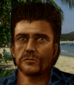

---
status: planned
priority: medium
origin: ja2
unit_id: Jazz_Nervous
portrait_id: Nervous
affiliation: MERC
role: Autorifleman
tier: Regular
specialization: Autoriflemen
gender: Male
nationality: USA
voice_source: ja2
starting_level: 3
will: 30
salary:
  starting: 700
  increase: 200
  lv1: 350
  max: 2200
medical_deposit: standard
haggling: normal
executable: false
---

# Нервный — Фрэнки «Нервный» Гордон

## Identity

| Field | RU | EN |
| --- | --- | --- |
| Name | Фрэнки «Нервный» Гордон | Фрэнки «Нервный» Гордон |
| Nick | Нервный | Nervous |
| AllCapsNick | НЕРВНЫЙ | NERVOUS |
| Title | Суперочередь | Суперочередь |
| Email | Nervous@merc.com | Nervous@merc.com |
| snype_nick | twitchy | twitchy |

## Bio

**RU:** Статы 60–70, Wisdom 58, Marksmanship 48, Explosives 31. Псих. Дружит с Blade и Ricochet; не любит Biff.

**EN:** EN draft: translate Bio RU at generation.

## Stats

| Stat | Value |
| --- | --- |
| Health | 65 |
| Agility | 70 |
| Dexterity | 60 |
| Strength | 60 |
| Wisdom | 58 |
| Will | 30 |
| Leadership | 15 |
| Marksmanship | 48 |
| Mechanical | 20 |
| Explosives | 31 |
| Medical | 10 |
| MaxHitPoints | 65 |
| StartingLevel | 3 |

## Perks

### StartingPerks

- (map JA2 skills to JA3 StartingPerks)
- `Jazz_Perk_Nervous`

### Named perk

| Field | Value |
| --- | --- |
| id | `Jazz_Perk_Nervous` |
| type | passive |
| DisplayName RU/EN | Суперочередь / Суперочередь |
| Description RU/EN | Усиленный автоогонь / Усиленный автоогонь |
| Mechanics | Super-burst style (longer/cheaper autofire). Exact numbers in impl. |

## Personality

- Quirks: Psycho
- Likes: Jazz_Blade, Jazz_Ricochet
- Dislikes: Biff
- National hates: —
- Refusal / Haggle notes: MERC

## Hire

- Access: MERC
- MedicalDeposit: standard; Haggling: normal; DaysUntilOnline: 0

## Inventory

- Equipment loot id: `Loot_JAZZ_Nervous`
- Presets (weights ~50/35/25/20):
  - *50: SMG family, light armor, extra mags

## JA2 face reference

Лицо в портрете должно быть **похоже на этот JA2-референс** (сохранить возраст, этничность, причёску, ключевые черты):

Файл: `nervous.ja2-face.gif`

## Portrait prompt

**Rules:** no weapons in hands/on shoulder (holstered pistol only as last resort). Role via **class kit**.

**CHARACTER_DESCRIPTION:** Match JA2 face reference `nervous.ja2-face.gif` (same face identity). Twitchy thin American, wild eyes, ammo bandolier and hearing protection — NO SMG in hands. Nervous energy.

**Preferred refs:** `MercPortraits/References/` matching gender/role

**Class kit:** Ammo bandolier, earpro, MERC patch, fingerless gloves

## Phrases — AIM chat

### Offline
- RU: Нервный... занят... пиши.
- EN: This is Nervous. Leave a message.

### GreetingAndOffer
- RU: Ч-чё? Стрелять будем?!
- EN: Nervous here.

### ConversationRestart
- RU: Вернёмся к делу.
- EN: Let's get back to it.

### IdleLine
- RU: Где враги где враги
- EN: Waiting.

### PartingWords
- RU: Уже бегу уже бегу!
- EN: I'm in.

### RehireIntro
- RU: Контракт заканчивается. Продлеваем?
- EN: Contract's ending. Extending?

### RehireOutro
- RU: Остаюсь.
- EN: I'm staying.

### Refusals / Haggles / Mitigations / ExtraPartingWords
- Draft relationship refusals/haggles from Personality at generation time.

## Phrases — VoiceResponse

- `voice_source: ja2` — reuse legacy VO where available; RU/EN subtitle drafts for minimum slots:
  - Selection: «Нервный!» / «Nervous!»
  - AimAttack / OpponentKilled / DeathGeneral / Downed / CombatStartPlayer / LevelUp / AmmoLow / Idle — standard drafts + relationship slots.

## Wiring

| Field | Value |
| --- | --- |
| Appearance | Nervous |
| VoiceResponseId | Jazz_Nervous |
| pollyvoice | Matthew |
| Portrait | Mod/Dv3mFVN/MercPortraits/Nervous.png |
| BigPortrait | Mod/Dv3mFVN/MercPortraits/Nervous_Big.png |
| CustomEquipGear | TryEquip Handheld A/B as role requires |
| FallbackMissingVR | Ice |
| Sources | AIM sheet «Наемники из JA1/2»; origin=ja2 |

## Open blockers

- none
