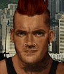

---
status: planned
priority: low
origin: ja2
unit_id: Jazz_Ricochet
portrait_id: Ricochet
affiliation: MERC
role: Melee
tier: Regular
specialization: Melee
gender: Male
nationality: USA
voice_source: ja2
starting_level: 3
will: 45
salary:
  starting: 800
  increase: 150
  lv1: 350
  max: 2400
medical_deposit: standard
haggling: normal
executable: false
---

# Рикошет — Тим «Рикошет» Саттонн

## Identity

| Field | RU | EN |
| --- | --- | --- |
| Name | Тим «Рикошет» Саттонн | Тим «Рикошет» Саттонн |
| Nick | Рикошет | Ricochet |
| AllCapsNick | РИКОШЕТ | RICOCHET |
| Title | Ближник | Ближник |
| Email | Ricochet@merc.com | Ricochet@merc.com |
| snype_nick | ricochet | ricochet |

## Bio

**RU:** Заниженные melee stats (Agility 60, Agility-move 70), Marksmanship 88. Loner. Likes Vicious; dislikes Sydney, Vicki, Scope.

**EN:** EN draft: translate Bio RU.

## Stats

| Stat | Value |
| --- | --- |
| Health | 70 |
| Agility | 60 |
| Dexterity | 70 |
| Strength | 75 |
| Wisdom | 55 |
| Will | 45 |
| Leadership | 15 |
| Marksmanship | 88 |
| Mechanical | 15 |
| Explosives | 15 |
| Medical | 10 |
| MaxHitPoints | 70 |
| StartingLevel | 3 |

## Perks

### StartingPerks

- (map JA2 skills)`n- named perk below

### Named perk

| Field | Value |
| --- | --- |
| id | `Jazz_Perk_Ricochet` |
| type | passive |
| DisplayName RU/EN | TBD / TBD |
| Description RU/EN | needs-design / needs-design |
| Mechanics | Sheet empty — needs-design. |

## Personality

- Quirks: Loner
- Likes: Jazz_Vicious
- Dislikes: Sidney, Vicki, Scope
- National hates: British?
- Refusal / Haggle notes: MERC

## Hire

- Access: MERC
- MedicalDeposit: standard; Haggling: normal; DaysUntilOnline: 0

## Inventory

- Equipment loot id: `Loot_JAZZ_Ricochet`
- Presets:
  - *50: night ops kit, martial arts wraps

## JA2 face reference

Лицо в портрете должно быть **похоже на этот JA2-референс** (сохранить возраст, этничность, причёску, ключевые черты):

Файл: `ricochet.ja2-face.gif`

## Portrait prompt

**Rules:** no weapons in hands/on shoulder (holstered pistol only as last resort). Role via **class kit**.

**CHARACTER_DESCRIPTION:** Match JA2 face reference `ricochet.ja2-face.gif` (same face identity). Melee specialist, night ops headband, hand wraps — NO gun.

**Preferred refs:** `MercPortraits/References/` matching gender/role

**Class kit:** Hand wraps, night-ops bandana, training pads

## Phrases — AIM chat

### Offline
- RU: Рикошет вне игры.
- EN: Ricochet unavailable.

### GreetingAndOffer
- RU: Рикошет.
- EN: Ricochet here.

### ConversationRestart / IdleLine / PartingWords / Rehire
- Restart RU/EN: Вернёмся к делу. / Let's get back to it.
- Idle RU/EN: Ну. / Well?
- Part RU/EN: Ок. / I'm in.
- RehireIntro: Контракт заканчивается. Продлеваем? / Contract's ending. Extending?
- RehireOutro: Остаюсь. / I'm staying.

### Extra
- Draft relationship lines at generation.

## Phrases — VoiceResponse

- `voice_source: ja2` — legacy VO reuse + minimum Selection/AimAttack/OpponentKilled/DeathGeneral/Downed/CombatStart/LevelUp/AmmoLow/Idle drafts.

## Wiring

| Field | Value |
| --- | --- |
| Appearance | Ricochet |
| VoiceResponseId | Jazz_Ricochet |
| pollyvoice | Matthew |
| Portrait / BigPortrait | Mod/Dv3mFVN/MercPortraits/Ricochet.png (+_Big) |
| FallbackMissingVR | Ice |
| Sources | AIM sheet JA1/2 block; origin=ja2 |

## Open blockers

- perk: needs-design
