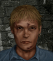

# Шенк — Брием «Шенк» Друз

## Identity

| Field | RU | EN |
| --- | --- | --- |
| Name | Брием «Шенк» Друз | Briem "Shank" Drews |
| Nick | Шенк | Shank |
| AllCapsNick | ШЕНК | SHANK |
| Title | Манчкин | The Munchkin |
| Email | Shank@merc.com | Shank@merc.com |
| snype_nick | shank | shank |

## Bio

**RU:** Статы 30–35, но Wisdom 80. Не умеет плавать, оптимист. Дружит с Динамо и Иваном. Работает за 20 долларов в день — дешевле только даром.

**EN:** Stats in the 30-35 range, but 80 Wisdom. Can't swim, incurable optimist. Friends with Dynamo and Ivan. Works for $20 a day — cheaper only if it were free.

## Stats

| Stat | Value |
| --- | --- |
| Health | 35 |
| Agility | 35 |
| Dexterity | 40 |
| Strength | 30 |
| Wisdom | 80 |
| Will | 35 |
| Leadership | 10 |
| Marksmanship | 40 |
| Mechanical | 10 |
| Explosives | 20 |
| Medical | 10 |
| MaxHitPoints | 35 |
| StartingLevel | 1 |

## Perks

### StartingPerks

- `Jazz_Perk_Shank`
- `Optimist`
- `Throwing`
- `MeleeTraining`

### Named perk

| Field | Value |
| --- | --- |
| id | `Jazz_Perk_Shank` |
| type | passive |
| DisplayName RU/EN | Не трогай меня / Don't Touch Me |
| Description RU/EN | Врагам сложнее попасть по Шенку в ближнем бою / Enemies have a harder time landing melee hits on Shank |
| Mechanics | Enemies making a melee attack against Shank suffer −50% CTH for that attack — he's too scrawny and jumpy to pin down. |

## Personality

- Quirks: CannotSwim, Optimist (Optimist wired; swimming is bio flavor only)
- Likes: `Jazz_Dynamo` (planned merc — Mitigation/ExtraPartingWords wiring activates once ready), `Ivan`
- Dislikes: —
- National hates: —
- Refusal / Haggle notes: no relationship refusals; joke-tier hire, no meaningful money refusal at this pay scale

## Hire

- Access: Locals → MERC hire
- MedicalDeposit: none; Haggling: normal; DaysUntilOnline: 0

## Inventory

- Equipment loot id: `Loot_JAZZ_Shank` → `JAZZ_Shank50/35/25/20`
- *50: `JazzArmor_UniformPants`, `Knife`×3
- *35: `Knife`×2
- *25: `Knife`×1
- *20: `Unarmed`

## JA2 face reference

Лицо в портрете должно быть **похоже на этот JA2-референс** (сохранить возраст, этничность, причёску, ключевые черты):

Файл: `shank.ja2-face.gif`

## Portrait prompt

**Rules:** no weapons in hands/on shoulder (holstered pistol only as last resort). Role via **class kit**. Face must match JA2 reference above.

**CHARACTER_DESCRIPTION:** Match JA2 face reference `shank.ja2-face.gif` (same face identity). Scrawny young thrower ~20, oversized jacket, knife pouch on belt — NO weapon in hand. Smug grin.

**Preferred refs:** `MercPortraits/References/` matching gender/role

**Class kit:** Knife pouch, oversized jacket, lucky charm

## Phrases — AIM chat

### Offline
- RU: Шенк... спит. Наверное.
- EN: This is Shank. Leave a message.

### GreetingAndOffer
- RU: Шенк! Не трогай мою фигню, но я слушаю.
- EN: Shank here. Don't touch my stuff, but I'm listening.

### ConversationRestart
- RU: Связь прервалась. Вернёмся к делу.
- EN: Line dropped. Let's get back to it.

### IdleLine
- RU: Всё будет отлично, вот увидишь.
- EN: It'll all work out, just watch.

### PartingWords
- RU: За двадцатку — я твой.
- EN: For twenty bucks, I'm yours.

### RehireIntro
- RU: Контракт заканчивается. Продлеваем?
- EN: Contract's ending. Extending?

### RehireOutro
- RU: Остаюсь. Тут весело.
- EN: I'm staying. It's fun here.

### Mitigations
- Dynamo/Ivan hired RU: О, Динамо (или Иван) уже тут? Отлично, вместе веселее.
- Dynamo/Ivan hired EN: Oh, Dynamo (or Ivan) is already in? Great, more fun together.

### ExtraPartingWords
- RU: Если нужен ещё один весёлый парень — берите Динамо.
- EN: If you need another fun guy, grab Dynamo.

## Phrases — VoiceResponse

- `voice_source: ja2` — reuse legacy VO where available; RU/EN subtitle drafts for minimum slots:
  - Selection: «Шенк готов!» / «Shank's ready!»
  - AimAttack (1): «Лови!» / «Catch!»
  - AimAttack (2): «Не трогай меня!» / «Don't touch me!»
  - OpponentKilled: «Есть!» / «Got him!»
  - DeathGeneral: «Ну вот, не повезло...» / «Well, no luck this time...»
  - Downed: «Меня зацепили! Но всё будет хорошо!» / «I'm hit! But it'll be fine!»
  - CombatStartPlayer: «Ножи готовы!» / «Knives ready!»
  - LevelUp: «Я расту!» / «I'm growing!»
  - AmmoLow: «Ножи кончаются!» / «Running low on knives!»
  - Idle: «Всё будет отлично!» / «It'll all be great!»
  - Praises (Dynamo/Ivan present): «Хорошая компания сегодня!» / «Good company today!»

## Wiring

| Field | Value |
| --- | --- |
| Appearance | Shank |
| VoiceResponseId | Jazz_Shank |
| pollyvoice | Matthew |
| Portrait | Mod/Dv3mFVN/MercPortraits/Shank.png |
| BigPortrait | Mod/Dv3mFVN/MercPortraits/Shank_Big.png |
| CustomEquipGear | TryEquip Handheld A Melee |
| FallbackMissingVR | Ice |
| Sources | AIM sheet «Наемники из JA1/2»; origin=ja2 |

## Open blockers

- none
