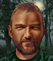

---
status: planned
priority: low
origin: wildfire
unit_id: Jazz_Steiger
portrait_id: Steiger
affiliation: AIM
role: Commander
tier: Elite
specialization: Leader
gender: Male
nationality: Germany
voice_source: wildfire
starting_level: 5
will: 70
salary:
  starting: 5500
  increase: 150
  lv1: 2500
  max: 11000
medical_deposit: large
haggling: high
executable: false
---

# Штайгер — Рудольф Штайгер

## Identity

| Field | RU | EN |
| --- | --- | --- |
| Name | Рудольф Штайгер | Рудольф Штайгер |
| Nick | Штайгер | Steiger |
| AllCapsNick | ШТАЙГЕР | STEIGER |
| Title | Дорогой немец | Дорогой немец |
| Email | Steiger@aim.com | Steiger@aim.com |
| snype_nick | steiger | steiger |

## Bio

**RU:** WF. Stats 75–85, Strength 69, Wisdom 90, Leadership 69, Marksmanship 94. Fear heat. Likes Henning, Laura, Grunty; dislikes Cord, Bull. Very expensive.

**EN:** EN draft: translate Bio RU.

## Stats

| Stat | Value |
| --- | --- |
| Health | 80 |
| Agility | 75 |
| Dexterity | 75 |
| Strength | 69 |
| Wisdom | 90 |
| Will | 70 |
| Leadership | 69 |
| Marksmanship | 94 |
| Mechanical | 35 |
| Explosives | 35 |
| Medical | 30 |
| MaxHitPoints | 80 |
| StartingLevel | 5 |

## Perks

### StartingPerks

- (map JA2 skills)`n- named perk below

### Named perk

| Field | Value |
| --- | --- |
| id | `Jazz_Perk_Steiger` |
| type | passive |
| DisplayName RU/EN | Ночка и обучение / Ночка и обучение |
| Description RU/EN | Night + Teacher / Night + Teacher |
| Mechanics | NightOps + Teacher. needs-design unique. |

## Personality

- Quirks: FearHeat
- Likes: Jazz_Henning, Jazz_Laura, Grunty
- Dislikes: Jazz_Cord, Jazz_Bull
- National hates: —
- Refusal / Haggle notes: WF expensive

## Hire

- Access: AIM
- MedicalDeposit: large; Haggling: high; DaysUntilOnline: 0

## Inventory

- Equipment loot id: `Loot_JAZZ_Steiger`
- Presets:
  - *50: officer kit

## JA2 face reference

Лицо в портрете должно быть **похоже на этот JA2-референс** (сохранить возраст, этничность, причёску, ключевые черты):

Файл: `steiger.ja2-face.gif`

## Portrait prompt

**Rules:** no weapons in hands/on shoulder (holstered pistol only as last resort). Role via **class kit**.

**CHARACTER_DESCRIPTION:** Match JA2 face reference `steiger.ja2-face.gif` (same face identity). Expensive German commander, neat, instructor tabs and night-ops monocle — NO gun.

**Preferred refs:** `MercPortraits/References/` matching gender/role

**Class kit:** Instructor tabs, monocle case, officer coat

## Phrases — AIM chat

### Offline
- RU: Штайгер занят.
- EN: Steiger unavailable.

### GreetingAndOffer
- RU: Штайгер.
- EN: Steiger here.

### ConversationRestart / IdleLine / PartingWords / Rehire
- Restart RU/EN: Вернёмся к делу. / Let's get back to it.
- Idle RU/EN: Жарко. / Well?
- Part RU/EN: Дорого — но да. / I'm in.
- RehireIntro: Контракт заканчивается. Продлеваем? / Contract's ending. Extending?
- RehireOutro: Остаюсь. / I'm staying.

### Extra
- Draft relationship lines at generation.

## Phrases — VoiceResponse

- `voice_source: wildfire` — legacy VO reuse + minimum Selection/AimAttack/OpponentKilled/DeathGeneral/Downed/CombatStart/LevelUp/AmmoLow/Idle drafts.

## Wiring

| Field | Value |
| --- | --- |
| Appearance | Steiger |
| VoiceResponseId | Jazz_Steiger |
| pollyvoice | Matthew |
| Portrait / BigPortrait | Mod/Dv3mFVN/MercPortraits/Steiger.png (+_Big) |
| FallbackMissingVR | Ice |
| Sources | AIM sheet JA1/2 block; origin=wildfire |

## Open blockers

- unique perk needs-design
