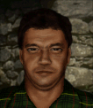

# Злобный — Жан-Пьер «Злобный» Вио

## Identity

| Field | RU | EN |
| --- | --- | --- |
| Name | Жан-Пьер «Злобный» Вио | Jean-Pierre "Vicious" Vio |
| Nick | Злобный | Vicious |
| AllCapsNick | ЗЛОБНЫЙ | VICIOUS |
| Title | Мачо | The Macho |
| Email | Vicious@aim.com | Vicious@aim.com |
| snype_nick | mademoiselles | mademoiselles |

## Bio

**RU:** Статы 80–90, Wisdom 55, Marksmanship 82. Агрессивный французский боец ближнего боя, клеится к Лиске, Пауку и — по слухам из JA2 — к некой Лаве. Терпеть не может британцев.

**EN:** Stats in the 80-90 range, 55 Wisdom, 82 Marksmanship. An aggressive French close-combat fighter who flirts with Fox, Spider, and — per unconfirmed JA2 rumor — someone named Lava. Can't stand the British.

## Stats

| Stat | Value |
| --- | --- |
| Health | 88 |
| Agility | 90 |
| Dexterity | 85 |
| Strength | 85 |
| Wisdom | 55 |
| Will | 40 |
| Leadership | 25 |
| Marksmanship | 82 |
| Mechanical | 10 |
| Explosives | 15 |
| Medical | 10 |
| MaxHitPoints | 88 |
| StartingLevel | 4 |

## Perks

### StartingPerks

- `Jazz_Perk_Vicious`
- `MeleeTraining`
- `CQCTraining`
- `Hotblood`

### Named perk

| Field | Value |
| --- | --- |
| id | `Jazz_Perk_Vicious` |
| type | passive |
| DisplayName RU/EN | Дамский угодник / Ladies' Man |
| Description RU/EN | Растущий бонус ОД за каждую женщину в отряде; удваивается, если в отряде Лиска, Паук или Айра; убийство в ближнем бою даёт +2 ОД / Escalating AP bonus per woman in the squad; doubled if Fox, Spider, or Ira is present; a melee kill grants +2 AP |
| Mechanics | At the start of combat, Vicious gains +1 AP for each female merc in the active squad (max 5 stacks / +5 AP). If Fox, `Jazz_Spider`, or `Jazz_Ira` is in the squad, this per-woman bonus is doubled for that combat. Any melee kill by Vicious grants an immediate +2 AP on top. |

## Personality

- Quirks: Aggressive
- Likes: `Fox`, `Jazz_Spider` (flirts with both; Lava mentioned in JA2 lore is Bio flavor only — not a valid unit id in this mod, so not wired)
- Dislikes: —
- National hates: British — Haggle trigger, same pattern as Colby/Conrad's Americans haggle
- Refusal / Haggle notes: standard AIM money/death-toll refusals; haggles when squad is full of British mercs; mitigation when Fox or Spider hired

## Hire

- Access: AIM hire
- MedicalDeposit: standard; Haggling: normal; DaysUntilOnline: 0

## Inventory

- Equipment loot id: `Loot_JAZZ_Vicious` → `JAZZ_Vicious50/35/25/20`
- *50: `JazzArmor_LeatherJacketBlk`, `Knife_Sharpened`×2, `Knife_Balanced`×2, `SmokeGrenade`×1, `CombatStim`×2
- *35: `JazzArmor_LeatherJacketBlk`, `Knife_Sharpened`×2, `Knife_Balanced`×1
- *25: `JazzArmor_LeatherArmor`, `Knife_Sharpened`×1, `Knife_Balanced`×1
- *20: `JazzArmor_LeatherArmor`, `Knife_Sharpened`×1

No firearm in any tier — Vicious closes distance and fights with blades, same pattern as Blade.

## JA2 face reference

Лицо в портрете должно быть **похоже на этот JA2-референс** (сохранить возраст, этничность, причёску, ключевые черты):

Файл: `vicious.ja2-face.gif`

## Portrait prompt

**Rules:** no weapons in hands/on shoulder (holstered pistol only as last resort). Role via **class kit**.

**CHARACTER_DESCRIPTION:** Match JA2 face reference `vicious.ja2-face.gif` (same face identity). Handsome, arrogant French merc ~30, open collar under tactical vest, knife sheaths on chest harness and a charm bracelet — NO gun. Smug smirk.

**Preferred refs:** `MercPortraits/References/` matching gender/role

**Class kit:** Knife sheaths, cologne vial, open collar, AIM pin

## Phrases — AIM chat

### Offline
- RU: Злобный занят дамами. Пишите — если повезёт, отвечу.
- EN: Vicious is busy with the ladies. Leave a message — if you're lucky, I'll reply.

### GreetingAndOffer
- RU: Oui? Жан-Пьер слушает. Дело срочное?
- EN: Oui? Jean-Pierre listening. Is this urgent?

### ConversationRestart
- RU: Связь прервалась. Вернёмся к делу.
- EN: Line dropped. Let's get back to it.

### IdleLine
- RU: Ну же, командирша. Время не ждёт.
- EN: Come on, commander. Time's wasting.

### PartingWords
- RU: Я уже еду — и, конечно, красиво.
- EN: I'm already on my way — and looking good, of course.

### RehireIntro
- RU: Контракт заканчивается. Продлеваем, chérie?
- EN: Contract's ending. Extending, chérie?

### RehireOutro
- RU: Остаюсь. Здесь веселее, чем дома.
- EN: I'm staying. It's more fun here than at home.

### Haggles
- British mercs hired RU: Отряд полон англичан... Ладно, но за такие муки полагается надбавка.
- British mercs hired EN: Your squad's full of Brits... Fine, but that kind of suffering costs extra.
- Money RU: Мой шарм стоит дороже, чем ты предлагаешь.
- Money EN: My charm costs more than you're offering.

### Mitigations
- Fox/Spider hired RU: О, Лиска или Паук уже здесь? Тогда я определённо в деле.
- Fox/Spider hired EN: Oh, Fox or Spider's already in? Then I'm definitely in.

### ExtraPartingWords
- RU: Если ищете ещё одну прекрасную даму в отряд — зовите Лиску.
- EN: If you're looking for another lovely lady for the squad — call Fox.

## Phrases — VoiceResponse

- `voice_source: ja2` — reuse legacy VO where available; RU/EN subtitle drafts for minimum slots:
  - Selection: «Злобный к вашим услугам.» / «Vicious at your service.»
  - AimAttack (1): «Ближе, ближе...» / «Closer, closer...»
  - AimAttack (2): «Красиво и быстро.» / «Fast and beautiful.»
  - OpponentKilled: «Voilà.» / «Voilà.»
  - DeathGeneral: «Не так я хотел закончить...» / «Not the ending I wanted...»
  - Downed: «Меня зацепили, но я всё ещё красив!» / «They got me, but I still look good!»
  - CombatStartPlayer: «Наконец-то action.» / «Finally, some action.»
  - LevelUp: «Ещё лучше, чем вчера.» / «Even better than yesterday.»
  - AmmoLow: «Нож не кончается — жаль, что не всё остальное.» / «Knife's endless — shame the rest isn't.»
  - Idle: «Скучно без дела.» / «Bored without a job.»
  - Praises (Fox/Spider present): «Хорошая компания сегодня.» / «Good company today.»

## Wiring

| Field | Value |
| --- | --- |
| Appearance | Vicious |
| VoiceResponseId | Jazz_Vicious |
| pollyvoice | Matthew |
| Portrait | Mod/Dv3mFVN/MercPortraits/Vicious.png |
| BigPortrait | Mod/Dv3mFVN/MercPortraits/Vicious_Big.png |
| CustomEquipGear | TryEquip Handheld A/B Melee (knife-first, no ranged default) |
| FallbackMissingVR | Ice |
| Sources | AIM sheet «Наемники из JA1/2»; origin=ja2 |

## Open blockers

- none
