# Squad role icons (enemy satellite)

Каталог PNG для сателлитных иконок отрядов Global AI / фракций. Файлы — `64×64`, **прозрачный** canvas вне щита (как у `legion.png` / `army.png`), щит фракции + ivory-силуэт роли.

Новые иконки создавать по skill [`.agents/skills/create-jazz-squad-icons/SKILL.md`](../../../.agents/skills/create-jazz-squad-icons/SKILL.md).

Пути runtime: `Mod/e6L4ECj/SquadsIcons/Enemy/<faction>/<faction>_<ROLE>_squad.png`  
Ассеты: [`SquadsIcons/Enemy/`](../../../SquadsIcons/Enemy/)

Раскладка: `_shields/` (пустые щиты), `<faction>/` (ролевые PNG), `_misc/` (прочее).  
Стратегический контекст: [strategy-squads-sectors.md](strategy-squads-sectors.md) · wiki: [legion-global-ai.md](../../wiki/legion-global-ai.md)

---

## Базовые щиты фракций

Пустой щит без ролевого символа (подложка для композита).

| Фракция | Файл | Щит |
| --- | --- | --- |
| Legion | `_shields/legion.png` |  |
| Army | `_shields/army.png` | 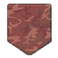 |
| Adonis | `_shields/adonis.png` |  |
| Rebels | `_shields/rebels.png` | 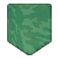 |
| Smugglers | `_shields/smugglers.png` |  |

Доп. варианты щитов (не ролевые): `_shields/army2.png`, `_shields/army3.png`, `_shields/rebels2.png`, `_shields/rebels3.png`; прочее: `_misc/enemy_squad.png`, `_misc/nazi.png`.

---

## Роли — смысл и символ

| Role ID | Смысл | Символ | Статус runtime (Legion) |
| --- | --- | --- | --- |
| `major` / BASE | Штаб / Major response | череп | wired → `legion/legion_BASE_squad.png` |
| `garrison` | Держит сектор | башня / rook | wired |
| `patrol` | Патруль ключевых точек | скрещённые стрелы | wired |
| `recon` | Наблюдение / разведка | бинокль | wired |
| `qrf` | Быстрая реакция | тесак / cutlass | wired |
| `supply` | Конвой снабжения | грузовик | wired |
| `shipment` | Алмазный груз в HQ | грузовик + ромб | wired |
| `reinforce` | Пограничное усиление гарнизона | плюс | wired |
| `support` | Малая огневая поддержка (снайпер/MG/миномёт) | прицел / reticle | wired → `legion/legion_SUPPORT_squad.png` |
| `retribution` | Карательный удар Major с HQ | кулак | wired |
| `recruiter` | Вербовщик / агитатор | мегафон | asset only |
| `manpower` | Конвой живой силы | колонна солдат с флагом | asset only |
| `tax` | Сбор налогов / дани | мешок с монетами | asset only |

`wired` = путь в `Guardpost_Patrols.lua` → `JAZZ_GetLegionAISquadIcon`.  
`asset only` = PNG есть у всех фракций, роль в director ещё не привязана.

Имена файлов: `<faction>/<faction>_<ROLE>_squad.png`  
`faction` ∈ `legion` · `army` · `adonis` · `rebels` · `smugglers`

---

## Галерея по ролям

### BASE / major — череп

| Legion | Army | Adonis | Rebels | Smugglers |
| --- | --- | --- | --- | --- |
| 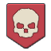 | 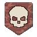 | 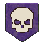 |  | 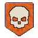 |

### GARRISON — башня

| Legion | Army | Adonis | Rebels | Smugglers |
| --- | --- | --- | --- | --- |
| 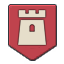 | 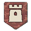 |  |  |  |

### PATROL — скрещённые стрелы

| Legion | Army | Adonis | Rebels | Smugglers |
| --- | --- | --- | --- | --- |
| 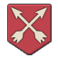 | 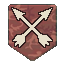 |  | 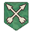 | 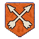 |

### RECON — бинокль

| Legion | Army | Adonis | Rebels | Smugglers |
| --- | --- | --- | --- | --- |
|  |  |  |  | 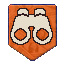 |

### QRF — тесак

| Legion | Army | Adonis | Rebels | Smugglers |
| --- | --- | --- | --- | --- |
| 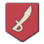 | 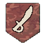 | 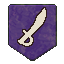 |  | 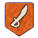 |

### SUPPLY — грузовик

| Legion | Army | Adonis | Rebels | Smugglers |
| --- | --- | --- | --- | --- |
|  |  | 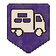 | 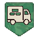 |  |

### SHIPMENT — грузовик + ромб

| Legion | Army | Adonis | Rebels | Smugglers |
| --- | --- | --- | --- | --- |
|  | 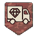 | 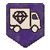 |  | 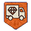 |

### REINFORCE — плюс

| Legion | Army | Adonis | Rebels | Smugglers |
| --- | --- | --- | --- | --- |
|  | 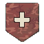 | 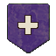 | 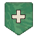 | 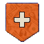 |

### SUPPORT — прицел *(STRATEGY-024)*

| Legion | Army | Adonis | Rebels | Smugglers |
| --- | --- | --- | --- | --- |
| 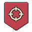 | 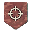 | 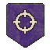 | 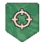 | 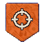 |

### RETRIBUTION — кулак

| Legion | Army | Adonis | Rebels | Smugglers |
| --- | --- | --- | --- | --- |
|  | 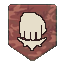 |  | 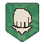 | 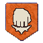 |

### RECRUITER — мегафон *(asset only)*

| Legion | Army | Adonis | Rebels | Smugglers |
| --- | --- | --- | --- | --- |
| 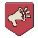 | 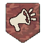 |  |  |  |

### MANPOWER — колонна солдат *(asset only)*

| Legion | Army | Adonis | Rebels | Smugglers |
| --- | --- | --- | --- | --- |
|  |  |  |  |  |

### TAX — мешок с монетами *(asset only)*

| Legion | Army | Adonis | Rebels | Smugglers |
| --- | --- | --- | --- | --- |
| 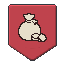 |  | 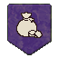 |  |  |

---

## Style bible (кратко)

- Canvas `64×64`, **прозрачный** фон вне щита (не заливать непрозрачным чёрным)
- Щит: плоский верх, вертикальные бока, остриё снизу
- Символ: ivory/cream, толстый силуэт, читается в мелком масштабе
- Без текста, цифр, градиентов, фотореализма
- Legion: сплошной madder-red; Army — красно-коричневый camo; Adonis — purple; Rebels — green camo; Smugglers — money/orange

Порты фракций: ivory-маска с `legion_*_squad.png` → поверх щита фракции + тёмный 1px outline символа. Маска обязана игнорировать прозрачные пиксели (`A < 200`).

---

## Связанные места кода

- Резолв Legion icons: `Code/Guardpost_Patrols.lua` (`JAZZ_GetLegionAISquadIcon`, role → path map)
- UI bind: `SquadWindow:SpawnSquadIcon` / `GetSatelliteIconImagesSquad`
- Technical overview: [strategy-squads-sectors.md](strategy-squads-sectors.md)
